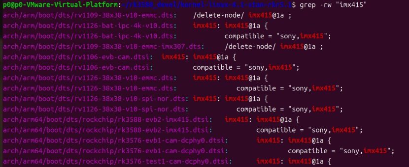
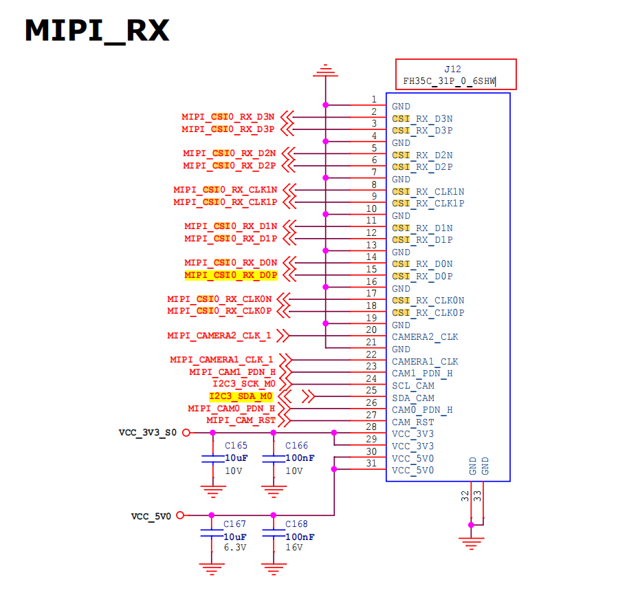
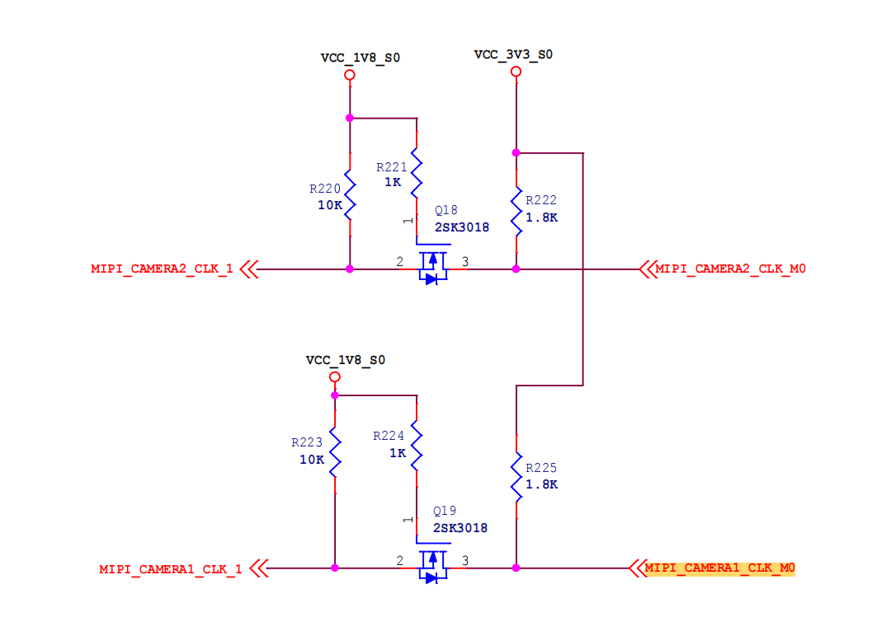

# IMX415 设备树编写笔记

**平台：** Radxa Rock 5C (RK3588S) + IMX415 (SONY STARVIS 4K)
**核心工作：** 根据原理图追踪硬件连接 → 编写设备树（DTS）配置
**参考文件：** `rk3588-evb1-imx415.dtsi` / `rk3588-evb2-imx415.dtsi`

---

## 一、EVB 文件选择策略

### 1.1 为什么有那么多 EVB 文件？

使用 `grep -rw "imx415"` 会发现大量 EVB 设备树文件，如 `evb1`、`evb2`、`evb3`、`evb7`、`lp4`、`lp5` 等后缀。



这源于 Rockchip SDK 的分发策略——覆盖多硬件形态：

| EVB 后缀 | 对应形态 |
|----------|---------|
| EVB1 | 全功能旗舰大板（RK3588 满血版） |
| EVB2 / EVB3 / EVB7 | 平板、IPC（安防）、车载等特定领域精简板 |
| lp4 / lp5 | 内存类型差异（LPDDR4 / LPDDR5） |
| linux-ipc | IPC（网络摄像头）专用 |

此外，RK3588S 是 RK3588 的 Cost-down 版本，封装更小、接口更少。部分 EVB 专门针对 RK3588S。

**结论：** 这些文件本质上是代码模板。它们针对同一颗 Sensor（IMX415）的内部节点配置几乎一样，唯一的区别在于挂载到不同的 I2C 总线和 MIPI PHY 通道上。

### 1.2 该以哪个文件为参考？

**基础节点参考（Sensor 配置）：** 选择 `rk3588-evb1-imx415.dtsi` 或 `rk3588-evb2-imx415.dtsi`。

原因：这两个文件代表了 RK3588 系列最标准的 V4L2 异步注册（Async Subdev）拓扑结构。

> **注意：** 切忌直接 `#include` 上述文件。Radxa 5C 的原理图与官方 EVB **完全不同**，需要把参考文件中的代码"摘抄并修改"到 Radxa 5C 的主设备树中。

### 1.3 要修改哪个文件？

在 Linux 设备树架构中：
- **`.dtsi`（Include）**：头文件，描述 SoC 通用特性或特定模块
- **`.dts`（Source）**：顶层文件，代表一块具体的物理开发板。DTC 编译器将 `.dts` 及其引用的所有 `.dtsi` 展开，编译成 `.dtb`

所有基于 Radxa 5C 原理图的定制修改，最终都必须体现在 `rk3588s-rock-5c.dts` 中。

### 1.4 具体策略（模块化分离法）

**步骤 1：** 在 `arch/arm64/boot/dts/rockchip/` 下新建 `rk3588s-rock-5c-imx415.dtsi`，将所有摄像头相关拓扑写在该文件中。

**步骤 2：** 在 `rk3588s-rock-5c.dts` 文件末尾引用：

```devicetree
#include "rk3588s-rock-5c-imx415.dtsi"
```

---

## 二、原理图追踪与 PHY 识别

看硬件原理图，目的是找到 Radxa 5C 用到的 CSI 接口。

### 2.1 物理接口端




**管脚定义：** 31-Pin FPC 座子包含了 `CSI_RX_D0P/N` 到 `CSI_RX_D3P/N` 的 4 条数据 Lane，以及 2 条时钟 Lane。

**原理图网络标号：** 座子引出的网络标号为 `MIPI_CSI0_RX_D0P` 等。

**I2C 控制线：** 摄像头的 I2C 控制线连接到了 `I2C3_SDA_M0` 和 `I2C3_SCL_M0`（即 SoC 的 I2C3 模块）。

### 2.2 SoC 接收端分析

RK3588S 有两类 MIPI 接收器，通过网络标号追踪确定用哪个：

**类型 A：纯 D-PHY（Dedicated D-PHY）——我们用的就是这个**

- 追踪 `MIPI_CSI0_RX_D0P` 网络 → 原理图第 8 页「MIPI DPHY CSI_RX Port0」
- 标注：**MIPI V1.2 2.5Gbps**（纯 D-PHY）
- 设备树对应：`csi2_dphy0`

**类型 B：D/C-PHY 混合型（Combo PHY）——未使用**

- 原理图第 9 页「MIPI D/C-PHY CSI_RX Port0」
- 标注：D-PHY V2.0 4.5Gbps / C-PHY V1.1 5.7Gbps
- Radxa 5C 的 31-Pin 接口数据线没有接到这里

### 2.3 映射关系推导（三步法）

#### 第一步：从原理图区分 PHY 的物理类型

- **类型 A（纯 D-PHY）：** 模块命名 `MIPI DPHY CSI_RX Port0`，标注 `MIPI V1.2 2.5Gbps`。老旧但极其稳定，只能做 CSI 接收（RX）。
- **类型 B（D/C-PHY 混合型）：** 模块命名 `MIPI D/C-PHY DSI_TX Port1` / `MIPI D/C-PHY CSI_RX Port0`，标注 `D-PHY:V2.0 4.5Gbps/Lane` 和 `C-PHY:V1.1 5.7Gbps/Trio`。新一代 Combo PHY。

#### 第二步：对应 Rockchip 内核设备树的命名法则

| PHY 类型 | 设备树前缀 | compatible 字符串 |
|----------|-----------|------------------|
| 纯 D-PHY | `csi2_dphy` | `"rockchip,rk3588-csi2-dphy"` |
| D/C-PHY 混合 | `csi2_dcphy`（多一个 **c**） | `"rockchip,rk3588-csi2-dcphy"` |

#### 第三步：通过端口号精准锁定

原理图第 8 页的模块全称是 `MIPI DPHY CSI_RX Port0`，`Port0` 代表第 0 个实例。**前缀 `csi2_dphy` + 后缀实例号 `0` = 设备树节点 `csi2_dphy0`**。


CSI 对应的 MIPI 接收器为 **MIPI DPHY0 RX**，对应设备树中的 `csi2_dphy0`。

### 2.4 验证方法

```bash
# 查看芯片底层 PHY 定义
grep -A 5 "csi2_dphy0:" arch/arm64/boot/dts/rockchip/rk3588*.dtsi
# 输出: phy@fd5b0000, compatible = "rockchip,rk3588-csi2-dphy"

grep -A 5 "csi2_dcphy0:" arch/arm64/boot/dts/rockchip/rk3588*.dtsi
# 输出: phy@feda0000, compatible = "rockchip,rk3588-csi2-dcphy"
```

---

## 三、MIPI 通信基础（补充知识）

### 3.1 IMX415 传感器概述

IMX415 是 SONY 的星光级（STARVIS）CMOS 图像传感器，Type 1/2.8 寸规格：

| 参数 | 值 |
|------|-----|
| 有效分辨率 | 3840×2160 (约 829 万像素，标准 4K UHD) |
| 单像素尺寸 | 1.45 µm × 1.45 µm |
| 彩色滤镜 | Bayer RGB（拜耳阵列） |
| 输出位宽 | 10-bit / 12-bit RAW |
| 最高帧率 | 4K@90fps（4-Lane 全带宽） |
| 接口 | MIPI CSI-2 D-PHY, 4-Lane |

### 3.2 MIPI 协议简介

MIPI（移动行业处理器接口）联盟为移动设备制定内部接口标准，旨在用更少的引脚、更低的功耗和更好的抗电磁干扰能力实现高速数据传输。

与摄像头最相关的两个协议：
- **CSI（Camera Serial Interface）**：相机串行接口，图像数据从摄像头传输到处理器
- **DSI（Display Serial Interface）**：显示器串行接口，图像数据从处理器传输到显示屏

IMX415 使用的是 **MIPI CSI-2** 协议。

### 3.3 I2C 控制通道

MIPI CSI-2 是一条高速、单向的"数据通道"（摄像头 → 处理器）。但处理器需要配置摄像头（设置分辨率、帧率、曝光等），这需要一条独立的双向控制通道——**I2C（IIC）**。

| 通道 | 方向 | 速率 | 用途 |
|------|------|------|------|
| MIPI CSI-2 | 单向（Sensor → SoC） | Gbps 级 | 传输图像数据 |
| I2C | 双向 | 400kHz | 配置 Sensor 寄存器 |

### 3.4 为什么需要 4-Lane？

MIPI CSI-2 D-PHY 中，Lane 数量决定带宽上限：

```
4K@60fps RAW10 理论吞吐：
  3840 × 2160 × 10bit × 60fps ≈ 4.97 Gbps
  单 Lane 带宽：~2.5 Gbps（RK3588 DPHY 极限）
  2-Lane：5.0 Gbps → 勉强，有风险
  4-Lane：10.0 Gbps → 充足
```

所以设备树中配置 `data-lanes = <1 2 3 4>;` 使用全部 4 条 Lane 确保全带宽。

### 3.5 物理连接结构

IMX415 与 RK3588S 间的物理连接：

```
IMX415                          RK3588S
┌────────┐                    ┌──────────┐
│        │  CSI_RX_D0P/N ────┤          │
│        │  CSI_RX_D1P/N ────┤  MIPI    │
│ IMX415 │  CSI_RX_D2P/N ────┤  DPHY0   │
│        │  CSI_RX_D3P/N ────┤  RX      │
│        │  CSI_RX_CLK0P/N ──┤          │
│        │                    └──────────┘
│        │  SDA ─────────────┤ I2C3    │
│        │  SCL ─────────────┤          │
│        │                    ┌──────────┐
│        │  XVCLK (24MHz) ←──┤ CRU      │
│        │  PWDN ←───────────┤ GPIO     │
│        │  RESET ←──────────┤          │
└────────┘                    └──────────┘
```

| 信号线 | 数量 | 说明 |
|--------|------|------|
| CSI_RX_D0P/N ~ D3P/N | 4 对差分线 | 承载 MIPI 图像数据 |
| CSI_RX_CLK0P/N | 1 对差分线 | D-PHY 时钟通道 |
| SDA / SCL（I2C） | 2 根 | 控制通道，配置 Sensor |
| XVCLK | 1 根 | 外部时钟 24MHz |
| PWDN / RESET | 各 1 根 | 休眠控制 / 复位 |

### 3.6 时钟恢复与 8B/10B 编码

**为什么需要复杂的时钟恢复？** 在 Mbps 级别的速率下，即使 0.1mm 的线长差异都会导致信号不同步。MIPI 的设计哲学是让每根数据线独立工作，不依赖外部统一时钟的严格同步。

**8B/10B 编码的核心作用：**

如果传输纯白或纯黑图像，原始数据可能是长串的 `11111111` 或 `00000000`，几乎没有跳变。接收端的 PLL（锁相环）无法锁定频率，也无法维持直流平衡。

编码规则：
- 8-bit 原始数据 → 查表编码为 10-bit
- 保证足够多的 0↔1 跳变（时钟恢复必要条件）
- 维持 DC 平衡（防止基线漂移）

**时钟恢复完整流程：**

```
发送端：
  24MHz 基准 → PLL 倍频 → 高速串行发送（~540MHz）

接收端：
  解析数据流跳变 → PLL 锁定频率 → 生成本地接收时钟
  
  8B/10B 解码 → 恢复原始 8-bit 数据
```

**与传统并行接口对比：**

| 特性 | 传统并行接口 | MIPI CSI-2 |
|------|------------|-----------|
| 时钟线 | 需要 1 根专用时钟线 | 时钟信息嵌入数据流 |
| 同步要求 | 所有线严格同步，高速下几乎不可能 | 每根数据线独立工作 |
| 线路数量 | 多 | 少 |
| 高速可靠性 | 差 | 通过 8B/10B 编码保证 |

---

## 四、设备树配置详解

### 4.1 时钟配置

#### 物理路径追踪

```
CRU（RK3588 时钟管理单元）
  → MIPI_CAMERA1_CLK_M0（GPIO1_B6 复用功能 2）
  → 电平转换电路（3.3V → 1.8V）
  → IMX415 XVCLK 引脚（24MHz）
```

原理图中 `CAMERA1_CLK` 对应网络编号 `MIPI_CAMERA1_CLK_1`（第 17 页），而 `MIPI_CAMERA1_CLK_1` 由 `MIPI_CAMERA1_CLK_M0` 提供时钟信号。继续查阅得出 `MIPI_CAMERA1_CLK_M0` 为 `GPIO1_B6`。

硬件工程师将这个特定的 GPIO 引脚连接到了 IMX415 的时钟输入引脚。
逻辑线: 摄像头需要时钟 → RK3588S 的 CRU 产生时钟 → 时钟通过复用的 GPIO 引脚输出 → 设备树描述时钟来源和引脚功能切换。

原理图中CAMERA1_CLK 对应网络编号 MIPI_CAMERA1_CLK_1 第17页
而MIPI_CAMERA1_CLK_1 由 MIPI_CAMERA1_CLK_M0 提供时钟信号
继续查阅得出MIPI_CAMERA1_CLK_M0 为 GPIO1_B6，所以这里我们还得设置引脚复用。

找到了物理功能，接下来要把它“翻译”成设备树能听懂的代码。
RK3588 内部有一个专门负责产生各种频率时钟的超级大管家，叫 CRU (Clock and Reset Unit)。
为了让设备树能够精准地调用 CRU 里的某一路时钟，内核工程师在 include/dt-bindings/clock/rk3588-cru.h 这个头文件中定义了所有的时钟宏。
在其中寻找与 MIPI_CAMERA1_CLK_M0 对应的宏

#### 设备树中的时钟宏

```devicetree
clocks = <&cru CLK_MIPI_CAMARAOUT_M0>;
clock-names = "xvclk";
```

#### ⚠ Rockchip 祖传拼写错误

`CAMERA` 被误写为 **`CAMARA`**（少了个 E）。在 `rk3588-cru.h` 中搜索 `CAMERA` 找不到对应宏，必须搜索 `CAMARA`。这个拼写错误因为向前兼容被永久保留在了 BSP 内核中。

真正的宏定义：

```c
/* rk3588-cru.h 文件中的实际定义 */
#define CLK_MIPI_CAMARAOUT_M0  255  // 后面的数字代表内核全局时钟 ID
```

#### 引脚复用配置

在 `rk3588s-pinctrl.dtsi` 中查找 `1 RK_PB6`，得到：

```devicetree
/omit-if-no-ref/
mipim0_camera1_clk: mipim0-camera1-clk {
    rockchip,pins =
        /* mipim0_camera1_clk */
        <1 RK_PB6 2 &pcfg_pull_none>;
};
```

完整的设备树配置：

```devicetree
clocks = <&cru CLK_MIPI_CAMARAOUT_M0>;
clock-names = "xvclk";
pinctrl-names = "default";
pinctrl-0 = <&mipim0_camera1_clk>;
```

#### 为什么 `clock-names` 必须是 `"xvclk"`？

查阅 IMX415 驱动源码（`drivers/media/i2c/imx415.c`）：

```c
clk = devm_clk_get(dev, "xvclk");
```

驱动在 probe 时会去设备树里寻找名字叫 `xvclk` 的时钟。如果写 `"clk24m"` 或 `"mclk"`，驱动会因找不到时钟而报错退出。

#### 为什么有两个 CLK？

Radxa 5C 的 31-Pin FPC 座子支持"单接口双摄像头"模组，两颗 Sensor 需要各自独立的 24MHz 时钟源。IMX415 是单摄 4-Lane，只用 `CAMERA1_CLK`，`CAMERA2_CLK` 悬空不用。

### 4.2 电平转换电路（3.3V → 1.8V）



原理图中存在基于 N 沟道 MOSFET（2SK3018）的电平转换电路：

```
主控 3.3V                   摄像头 1.8V
MIPI_CAMERAx_CLK_M0 ──┬── R(1.8K) ── VCC_3V3
                      │
                    Drain
                      ↑
            2SK3018 (N-MOSFET)
                      ↓
                    Source
                      │
                    R(10K)
                      │
MIPI_CAMERAx_CLK_1 ──┴── VCC_1V8
```

| 元件/信号 | 功能说明 |
|-----------|---------|
| Q18/Q19 (2SK3018) | N 沟道增强型 MOSFET，电平转换开关 |
| `MIPI_CAMERAx_CLK_M0` | 主控 **3.3V** 时钟信号输入 |
| `MIPI_CAMERAx_CLK_1` | 输出到摄像头 **1.8V** 时钟信号 |
| `VCC_1V8_S0` | 1.8V 电源域，摄像头侧电压基准 |
| `VCC_3V3_S0` | 3.3V 电源域，主控侧电压基准 |

**工作原理：**

| 输入 | MOSFET 状态 | 输出 |
|------|------------|------|
| 3.3V（高电平） | 关断（Vgs=0V） | 被 R=10K 上拉到 1.8V |
| 0V（低电平） | 导通（体二极管先导通） | 被拉到接近 0V |

**电阻作用：**

| 电阻 | 阻值 | 作用 |
|------|------|------|
| R220/R223 | 10K | 源极上拉，关断时输出稳定 1.8V |
| R221/R224 | 1K | 栅极上拉，钳位栅极电压到 1.8V |
| R222/R225 | 1.8K | 漏极上拉，为主控信号提供弱上拉 |

> **注意：** 这是**单向电平转换**，信号只能从 `M0` 流向 `CLK_1`，不能反向传输。下方的 Q19 电路与上方完全对称，是为另一路 Camera 设计的。

### 4.3 I2C 引脚复用

```devicetree
&i2c3 {
    status = "okay";
    pinctrl-names = "default";
    pinctrl-0 = <&i2c3m0_xfer>;
};
```

**为什么要配置 pinctrl？** RK3588S 的引脚具有多重功能（引脚复用）。`i2c3m0_xfer` 将 GPIO1_C0 和 GPIO1_C1 从普通 GPIO 切换为 I2C3 的 SDA/SCL 功能。

在 `rk3588-pinctrl.dtsi` 中的定义：

```devicetree
i2c3m0_xfer: i2c3m0-xfer {
    rockchip,pins =
        <1 RK_PC1 9 &pcfg_pull_none_smt>,  /* i2c3_scl_m0 */
        <1 RK_PC0 9 &pcfg_pull_none_smt>;  /* i2c3_sda_m0 */
};
```


> **注意：** 原理图中 `SDA_CAM` 对应 `I2C3_SDA_M0`，而 `GPIO1_C0` 的默认功能就是 `I2C3_SDA_M0`，所以这里不配置 pinctrl 也能工作。但为了代码清晰和跨平台兼容，建议保留。

### 4.4 电源配置

#### 电源域（Power Gating）

```devicetree
power-domains = <&power RK3588_PD_VI>;
```

`RK3588_PD_VI`（Video Input 电源域）控制 SoC 内部 MIPI 控制器、ISP 等视频输入相关模块的供电。不开启此域，MIPI 控制器和 ISP 无法工作。

**物理原理：**

SoC 内部划分多个电源域，每个域入口处设置 MOS 晶体管开关：
- 接通：电流流入域内，模块正常工作
- 切断：物理上切断供电，漏电流降为 0

PMU（电源管理单元）控制这些开关的开启与关闭。

#### PWDN（休眠引脚）

```devicetree
pwdn-gpios = <&gpio1 RK_PD5 GPIO_ACTIVE_HIGH>;
```

与电源域完全关断不同，PWDN 是一种**轻量休眠**——可以快速关掉/开启成像逻辑，不必整个重新上电。

**为什么有两个 PDN 引脚（CAM0 和 CAM1）？**

31-Pin 接口的第 29 脚（`CAM0_PDN_H`）和第 30 脚（`CAM1_PDN_H`）是为支持双摄像头模组预留的。IMX415 是 4-Lane 单摄模组，只用到 `CAM0_PDN_H`，`CAM1_PDN_H` 在模组内部悬空（NC），不需要配置。

### 4.5 复位引脚

```devicetree
reset-gpios = <&gpio1 RK_PD2 GPIO_ACTIVE_LOW>;
```

摄像头芯片上电后，内部逻辑状态可能是随机的，需要通过复位引脚强制清零。CAM_RST 对应网络编号 `MIPI_CAM_RST`，对应 GPIO `GPIO1_D2`。

### 4.6 IMX415 的四路供电

| 电源域 | 电压 | 用途 |
|--------|------|------|
| AVDD（模拟） | 2.9V | 光电转换、ADC 等模拟电路，纹波直接影响画质 |
| DVDD（数字） | 1.1V | 逻辑处理、MIPI 封包等数字电路 |
| OVDD/DOVDD（接口） | 1.8V | I2C 和 MIPI 接口电平基准 |
| VDD_IO | 1.8V / 3.3V | GPIO 接口电平 |

### 4.7 Sensor 基础节点（完整）

```devicetree
&i2c3 {
    status = "okay";
    pinctrl-names = "default";
    pinctrl-0 = <&i2c3m0_xfer>;

    imx415: imx415@1a {
        compatible = "sony,imx415";
        reg = <0x1a>;                     /* I2C 7-bit 地址 */

        clocks = <&cru CLK_MIPI_CAMARAOUT_M0>;
        clock-names = "xvclk";

        pinctrl-names = "default";
        pinctrl-0 = <&mipim0_camera1_clk>;

        power-domains = <&power RK3588_PD_VI>;

        pwdn-gpios = <&gpio1 RK_PD5 GPIO_ACTIVE_HIGH>;
        reset-gpios = <&gpio1 RK_PD2 GPIO_ACTIVE_LOW>;

        /* 模组元数据 */
        rockchip,camera-module-index = <0>;
        rockchip,camera-module-facing = "back";
        rockchip,camera-module-name = "RADXA-CAMERA-4K";
        rockchip,camera-module-lens-name = "DEFAULT";

        port {
            imx415_out0: endpoint {
                remote-endpoint = <&mipi_in_ucam0>;
                data-lanes = <1 2 3 4>;
            };
        };
    };
};
```

---

## 五、ISP 拓扑（port/endpoint 四级串联）

### 5.1 port/endpoint 核心概念

`port` 代表一个硬件模块的数据接口（输入或输出），`endpoint` 代表 port 上的具体连接点。

**类比理解：** `port` 就像电脑上的 USB 接口，`endpoint` 就像插在 USB 接口上的具体线端。

```devicetree
port {                                      // 这个硬件上有一个数据端口
    imx415_out0: endpoint {                 // 端口上的连接点
        remote-endpoint = <&mipi_in_ucam0>; // 指向对端
        data-lanes = <1 2 3 4>;            // 使用 4 Lane
    };
};
```

`remote-endpoint` 体现数据流连接关系。`<&mipi_in_ucam0>` 指向另一个硬件模块的 endpoint，建立"数据从 `imx415_out0` 流向 `mipi_in_ucam0`"的关系。

### 5.2 四级硬件处理流水线

MIPI 电信号进入 RK3588S 后的四级处理：

```
第一级：csi2_dphy0（物理层）
  接收高速差分信号 → 串转并 → 10bit→8bit 解码
  
第二级：mipi0_csi2（协议层）
  识别 CSI-2 协议包 → CRC 校验 → 剥离协议头 → 提取像素数据
  
第三级：rkcif_mipi_lvds（视频采集桥接）
  缓冲与格式适配 → 转换为 ISP 兼容的数据流

第四级：rkisp0_vir0（图像信号处理器）
  RAW Bayer 输入 → 去马赛克 → 白平衡 → 色彩校正 → YUV 输出
```

### 5.3 每级之间的物理连接

硬件模块之间有物理接口，端口描述将这些硬件连接"翻译"成设备树代码：

#### 第一级连接：摄像头 → D-PHY

物理接口：MIPI 差分信号线（CLK+/-，DATA+/-），高速模拟信号，需严格阻抗匹配。

```devicetree
/* Sensor 侧（输出端） */
imx415_out0: endpoint {
    remote-endpoint = <&mipidphy0_in_ucam0>;
    data-lanes = <1 2 3 4>;
};

/* PHY 侧（输入端） */
mipi_in_ucam0: endpoint@1 {
    reg = <1>;
    remote-endpoint = <&imx415_out0>;
    data-lanes = <1 2 3 4>;
};
```

#### 第二级连接：D-PHY → CSI-2 协议层

物理接口：芯片内部总线，并行数字信号，时钟同步。

```devicetree
csidcphy0_out: endpoint@0 {
    reg = <0>;
    remote-endpoint = <&mipi0_csi2_input>;
};

mipi0_csi2_input: endpoint@1 {
    reg = <1>;
    remote-endpoint = <&csidcphy0_out>;
};
```

#### 第三级连接：CSI-2 协议层 → CIF

物理接口：芯片内部专用数据通道，去除协议头的纯图像数据流。

```devicetree
mipi0_csi2_output: endpoint@0 {
    reg = <0>;
    remote-endpoint = <&cif_mipi_in0>;
};

cif_mipi_in0: endpoint {
    remote-endpoint = <&mipi0_csi2_output>;
};
```

#### 第四级连接：CIF → ISP

物理接口：芯片内部高速数据总线，格式化图像数据，支持 DMA 传输。

```devicetree
mipi_lvds_sditf: endpoint {
    remote-endpoint = <&isp0_vir0>;
};

isp0_vir0: endpoint@0 {
    reg = <0>;
    remote-endpoint = <&mipi_lvds_sditf>;
};
```

### 5.4 完整设备树代码

```devicetree
/* ========== 第一级：PHY 层 ========== */
&csi2_dphy0 {
    status = "okay";
    ports {
        #address-cells = <1>;
        #size-cells = <0>;

        port@0 {
            reg = <0>;
            #address-cells = <1>;
            #size-cells = <0>;

            mipi_in_ucam0: endpoint@1 {
                reg = <1>;
                remote-endpoint = <&imx415_out0>;
                data-lanes = <1 2 3 4>;
            };
        };

        port@1 {
            reg = <1>;
            #address-cells = <1>;
            #size-cells = <0>;

            csidcphy0_out: endpoint@0 {
                reg = <0>;
                remote-endpoint = <&mipi0_csi2_input>;
            };
        };
    };
};

/* ========== 第二级：CSI-2 协议层 ========== */
&mipi0_csi2 {
    status = "okay";
    ports {
        #address-cells = <1>;
        #size-cells = <0>;

        port@0 {
            reg = <0>;
            #address-cells = <1>;
            #size-cells = <0>;

            mipi0_csi2_input: endpoint@1 {
                reg = <1>;
                remote-endpoint = <&csidcphy0_out>;
            };
        };

        port@1 {
            reg = <1>;
            #address-cells = <1>;
            #size-cells = <0>;

            mipi0_csi2_output: endpoint@0 {
                reg = <0>;
                remote-endpoint = <&cif_mipi_in0>;
            };
        };
    };
};

/* ========== 第三级：CIF 桥接 ========== */
&rkcif_mipi_lvds {
    status = "okay";
    port {
        cif_mipi_in0: endpoint {
            remote-endpoint = <&mipi0_csi2_output>;
        };
    };
};

&rkcif_mipi_lvds_sditf {
    status = "okay";
    port {
        mipi_lvds_sditf: endpoint {
            remote-endpoint = <&isp0_vir0>;
        };
    };
};

/* ========== 第四级：ISP ========== */
&rkisp0_vir0 {
    status = "okay";
    port {
        #address-cells = <1>;
        #size-cells = <0>;

        isp0_vir0: endpoint@0 {
            reg = <0>;
            remote-endpoint = <&mipi_lvds_sditf>;
        };
    };
};
```

### 5.5 连接的双向性

每个物理连接在设备树中有双向描述：
- 上游模块的 `endpoint` 指向下游模块的 `endpoint`
- 下游模块的 `endpoint` 反指上游模块的 `endpoint`

这种双向引用确保了连接关系的完整性，驱动程序可以从任一端点找到连接的对端。

### 5.6 关键理解速查

| 术语 | 物理类比 | 含义 |
|------|---------|------|
| `port` | USB 接口 | 硬件模块的数据接口 |
| `endpoint` | USB 线端 | 接口上的具体连接点 |
| `remote-endpoint` | 指向对端的引用 | 数据流向的下一站 |
| `data-lanes` | Lane 编号 | `<1 2 3 4>` 使用全部 4 条 Lane |

---

## 六、模组元数据与 IQ 文件匹配

### 6.1 模组"身份证"

```devicetree
rockchip,camera-module-index = <0>;      // 摄像头编号
rockchip,camera-module-facing = "back";   // back 后置 / front 前置
rockchip,camera-module-name = "RADXA-CAMERA-4K";
rockchip,camera-module-lens-name = "DEFAULT";
```

这四个属性不参与底层硬件通信，作用是一张**"模组身份证"**。当摄像头 Probe 成功后，ISP 会去 `/etc/iqfiles/` 目录下寻找对应的图像调优文件（IQ 文件）。文件名拼接规则：`[sensor]_[name]_[lens-name].json`。

### 6.2 实际 IQ 文件验证

```bash
ls -l /etc/iqfiles/ | grep -i "imx415"
```

实际输出的文件列表：

```
-rw-rw-rw- 1 root root 752853 Sep 24  2024 imx415_CMK-OT2022-PX1_IR0147-50IRC-8M-F20.json
lrwxrwxrwx 1 root root     70 Jan 15 18:08 imx415_RADXA-CAMERA-4K_DEFAULT.json -> /usr/share/rockchip-iqfiles-rk3588/imx415_RADXA-CAMERA-4K_DEFAULT.json
```

两个文件的分析：

| 文件 | 类型 | 说明 |
|------|------|------|
| `imx415_CMK-OT2022-PX1_IR0147-50IRC-8M-F20.json` | 普通文件 | 原厂 EVB 的调优文件，对应原厂特定镜头 |
| `imx415_RADXA-CAMERA-4K_DEFAULT.json` | **软链接** | Radxa 官方针对 `RADXA-CAMERA-4K` 模组的专属调优 |

### 6.3 选择策略

**优先使用 Radxa 官方的调优文件** `imx415_RADXA-CAMERA-4K_DEFAULT.json`，因为 Radxa 工程师专门为 IMX415 + Radxa 5C 做过色彩和白平衡调优。

设备树中配置为：

```devicetree
rockchip,camera-module-name = "RADXA-CAMERA-4K";
rockchip,camera-module-lens-name = "DEFAULT";
```

这样 ISP 会去匹配 `imx415_RADXA-CAMERA-4K_DEFAULT.json`，这是当前系统环境下画质最好的最优解。

---

## 七、删除的节点及原因

从参考设备树中删除了以下不兼容的属性：

| 删除的属性 | 原因 |
|-----------|------|
| `lens-focus = <&cam_ircut0>` | Radxa 5C 的 IMX415 模组是**定焦模组**，无 VCM 马达。保留此字段会导致驱动强行寻找马达驱动，Probe 失败 |
| `avdd-supply = <&vcc_mipidcphy0>` | Radxa 5C 摄像头供电由主板电源开关直接控制，`vcc_mipidcphy0` 节点在 Radxa 5C 中不存在，保留会导致设备树编译报 undefined reference |

---

## 八、编译部署与调试验证

### ⚠ 最重要的运行时提醒

经过上述修改，代码架构已经准备就绪。但编译运行前，**请务必在后台运行 RKAIQ 服务器**，否则画面会全黑或严重偏色！

```bash
# 在后台启动 IMX415 的 3A 算法（自动曝光、白平衡等）
rkaiq_3A_server -d /dev/video11 &

# 然后再运行你的主程序
./your_application
```

### 第一阶段：内核编译与物理部署

**1. 物理连接（MIPI 接口严禁带电插拔！）**

- 断电：拔掉 Radxa 5C 电源
- 插线：将 IMX415 的 31-Pin 排线插入板子，注意金手指朝向，扣紧锁扣

**2. 编译并替换设备树**

```bash
# 编译内核和设备树
make ARCH=arm64 rockchip_linux_defconfig
make ARCH=arm64 rk3588s-rock-5c.dtb

# 推送到板子，替换 /boot/dtb/ 下的文件
scp arch/arm64/boot/dts/rockchip/rk3588s-rock-5c.dtb root@192.168.x.x:/boot/dtb/

# 重启
reboot
```

### 第二阶段：底层握手与环境验证

**1. 验证 I2C 握手与 Probe 状态**

```bash
dmesg | grep -i imx415
# 期待输出：imx415 3-001a: Detected imx415 id e0
```

常见失败原因：

| 失败原因 | 排查方向 |
|----------|---------|
| I2C 地址错误 | IMX415 是 0x1a（不是 0x34） |
| 复位引脚电平不对 | 检查 reset-gpios 电平极性 |
| 24MHz 时钟未起振 | 检查 CRU 时钟配置和引脚复用 |
| 电源域未开启 | 检查 power-domains 是否正确 |

**2. 验证 ISP 拓扑与获取正确的 /dev/videoX 节点**

```bash
# 查看多媒体管道拓扑
media-ctl -d /dev/media0 -p | grep "rkisp_mainpath"
# 期待输出：device node name /dev/video11
```

ISP 输出的节点号可能是 `/dev/video11`，需在 `main.cpp` 中修改对应的 `open()` 路径。

**3. 启动 RKAIQ 3A 服务器（绝对不可省略！）**

```bash
rkaiq_3A_server -d /dev/video11 &

# 验证加载了正确的 IQ 文件
dmesg | grep -i "iqfile"
# 期待输出：成功加载 imx415_RADXA-CAMERA-4K_DEFAULT.json
```

---

## 九、关键知识点速查

### 常见陷阱

| # | 陷阱 | 说明 |
|---|------|------|
| 1 | Rockchip "CAMARA" 拼写错误 | `CLK_MIPI_CAMARAOUT_M0` 而非 `CAMERA` |
| 2 | I2C 地址 | 7-bit 地址 0x1a（不是 0x34） |
| 3 | PHY 类型区分 | `csi2_dphy`（纯 D-PHY）vs `csi2_dcphy`（Combo PHY） |
| 4 | 电平转换 | 主控 3.3V → 摄像头 1.8V，MOSFET 实现 |
| 5 | 电源域 | 必须开启 `RK3588_PD_VI` |
| 6 | IQ 文件匹配 | 文件名拼接规则 `[sensor]_[name]_[lens-name].json` |
| 7 | 带电插拔 | MIPI 接口严禁带电插拔，极易烧毁 D-PHY |
| 8 | RKAIQ 服务 | 每次启动应用前必须启动 `rkaiq_3A_server` |

### 设备树配置速览（Checklist）

```devicetree
/* 需要在设备树中完成的配置清单 */
□ I2C 总线节点    → &i2c3 { status = "okay"; };
□ I2C 引脚复用    → pinctrl-0 = <&i2c3m0_xfer>;
□ IMX415 节点     → imx415@1a { ... };
□ 时钟配置        → clocks = <&cru CLK_MIPI_CAMARAOUT_M0>;
□ 时钟引脚复用    → pinctrl-0 = <&mipim0_camera1_clk>;
□ 电源域          → power-domains = <&power RK3588_PD_VI>;
□ PDN 引脚        → pwdn-gpios = <&gpio1 RK_PD5 GPIO_ACTIVE_HIGH>;
□ 复位引脚        → reset-gpios = <&gpio1 RK_PD2 GPIO_ACTIVE_LOW>;
□ 模组元数据      → rockchip,camera-module-xxx;
□ PHY 节点        → &csi2_dphy0 { status = "okay"; };
□ CSI-2 协议层    → &mipi0_csi2 { status = "okay"; };
□ CIF 桥接        → &rkcif_mipi_lvds { status = "okay"; };
□ ISP 节点        → &rkisp0_vir0 { status = "okay"; };
□ 四级 port 连接  → remote-endpoint 串联
```

### 相关文档索引

| 内容 | 位置 |
|------|------|
| 参考设备树 | `rk3588-evb1-imx415.dtsi` |
| 新建设备树 | `rk3588s-rock-5c-imx415.dtsi` |
| 主设备树（引用处） | `rk3588s-rock-5c.dts` |
| 时钟宏定义 | `include/dt-bindings/clock/rk3588-cru.h` |
| 引脚复用定义 | `rk3588-pinctrl.dtsi` |
| PHY 定义 | `rk3588.dtsi` 中 `csi2_dphy0` / `csi2_dcphy0` |
| IQ 文件目录 | `/etc/iqfiles/` |
| IMX415 驱动源码 | `drivers/media/i2c/imx415.c` |
