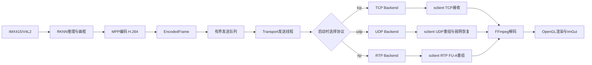
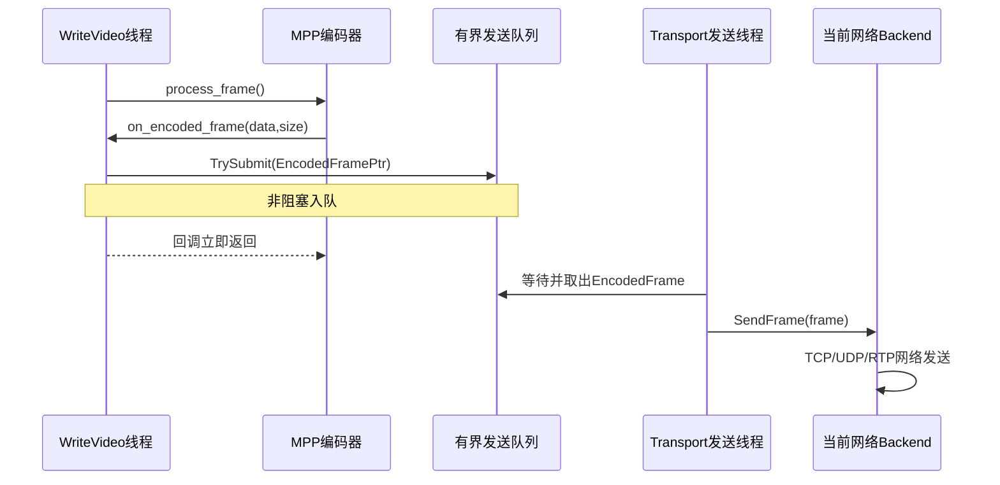
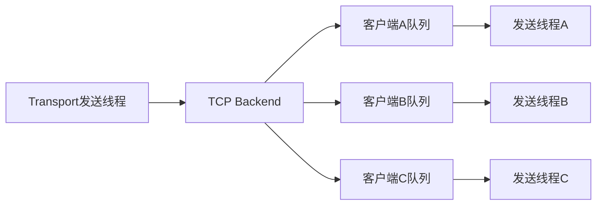
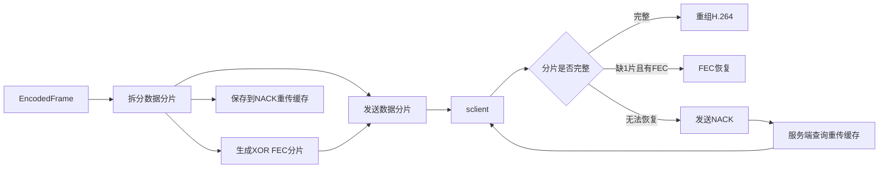
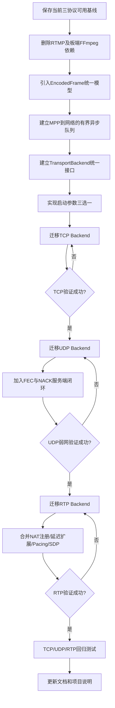

# TCP/UDP/RTP 三选一传输重构行动指南

## 1. 文档目的

本文档用于指导 DMA 项目从当前的“MPP 编码后同时分发 RTMP/TCP/UDP/RTP”逐步重构为：

> IMX415/V4L2 采集 → RKNN 推理与画框 → MPP 硬件编码 → TCP/UDP/RTP 三选一传输 → sclient 解码、渲染与弱网统计。

重构后的板端不再包含 RTMP 和 FFmpeg 封装代码。程序每次启动只选择 TCP、UDP、RTP 中的一种协议，不做运行中的自动热切换。

本文档是后续代码调整的行动基准。每完成一个阶段，都必须保证代码可编译，并完成该阶段规定的回归测试后再进入下一阶段。

---

## 2. 核心设计原则

### 2.1 保留现有 DMA 核心管线

以下模块继续使用当前 DMA 项目的实现，不从 `视频流媒体/项目/sserver` 替换：

- IMX415/V4L2/ISP 采集；
- DMABUF 和 RGA 图像处理；
- RKNN YOLOv5s 推理；
- MPP H.264 硬件编码；
- 当前线程池、帧保序和队列机制。

### 2.2 只迁移 sserver 的传输能力

从 `视频流媒体/项目/sserver` 选择性迁移：

- `EncodedFrame` 公共帧模型；
- 公共 TCP/UDP 协议结构；
- `ITransportBackend` 统一接口；
- TCP 多客户端、发送队列和背压；
- UDP 分片、FEC、NACK 和重传缓存；
- RTP FU-A、延迟扩展、Pacing 和 SDP；
- 公共日志、时间和延迟统计能力。

不迁移：

- sserver 的 V4L2 YUYV 采集；
- YUYV422 转 I420；
- x264 软件编码；
- sserver 原有程序入口和采集线程。

### 2.3 每次只运行一种传输协议

目标启动方式：

```bash
./build/cv --transport tcp
./build/cv --transport udp
./build/cv --transport rtp
```

第一阶段不实现 TCP、UDP、RTP 运行时自动切换。切换协议时停止板端和客户端，然后使用新参数重新启动。

### 2.4 MPP 与网络发送必须解耦

MPP 回调只负责：

1. 将 MPP 输出转换为具有稳定生命周期的 `EncodedFrame`；
2. 将 `EncodedFramePtr` 非阻塞放入有界发送队列；
3. 立即返回。

MPP 回调不得直接执行：

- `send()`、`sendto()`、`sendmsg()`；
- RTP Pacing 的 `clock_nanosleep()`；
- 等待客户端；
- NACK 重传；
- 大量网络分片发送。

所有网络操作由独立发送线程完成。

---

## 3. 最终运行架构



---

## 4. 目标线程与队列模型



建议初始参数：

| 参数 | 建议值 |
|---|---:|
| 发送队列深度 | 8 帧 |
| 最大排队时间 | 100 ms |
| 入队方式 | 非阻塞 |
| 队列满处理 | 丢弃过期帧并等待下一个 IDR |
| H.264 数据所有权 | MPP 回调中复制一次，之后用 `shared_ptr` 共享 |

不能使用无限队列。实时视频应优先限制延迟，而不是无限积压历史帧。

---

## 5. 第一阶段：保存当前可用基线

### 5.1 目标

保存当前 TCP、UDP、RTP 均可运行的版本，确保重构过程中能够对比和回退。

### 5.2 操作项

- [ ] 保存当前源代码版本；
- [ ] 记录板端构建和运行命令；
- [ ] 记录虚拟机客户端构建和运行命令；
- [ ] 保存 TCP、UDP、RTP 成功运行日志；
- [ ] 保存当前 Wireshark/tcpdump 抓包；
- [ ] 记录当前 FPS 和延迟基准；
- [ ] 保留 `DMA_旧架构` 中的 RTMP 实现和面试资料。

### 5.3 验收标准

- [ ] 当前版本可重新编译；
- [ ] TCP 可正常播放；
- [ ] UDP 可正常播放；
- [ ] RTP 可正常播放；
- [ ] 当前基准结果有文档或日志记录。

---

## 6. 第二阶段：移除 RTMP 和板端 FFmpeg 依赖

### 6.1 目标

新架构根目录只保留 MPP 编码以及 TCP、UDP、RTP 传输。

### 6.2 代码调整

- [ ] 删除新架构根目录的 `rtmp.c`；
- [ ] 删除新架构根目录的 `rtmp.h`；
- [ ] 从 `streamer.c` 移除 `RtmpContext`；
- [ ] 删除 `rtmp_enabled`；
- [ ] 删除 `init_rtmp_streamer()` 调用；
- [ ] 删除 RTMP `write_frame()` 调用；
- [ ] 从 `main.cpp` 删除 `rtmpPath`；
- [ ] 修改 `init_streamer()`，不再接收 RTMP URL；
- [ ] 从 `CMakeLists.txt` 删除 `rtmp.c`；
- [ ] 从板端 `CMakeLists.txt` 移除 FFmpeg `pkg_check_modules`；
- [ ] 移除板端对 `libavcodec`、`libavformat`、`libavutil`、`libswscale`、`libavdevice` 的直接链接；
- [ ] 更新构建依赖和项目说明。

目标接口：

```cpp
int init_streamer(
    int width,
    int height,
    int fps,
    int bitrate);
```

### 6.3 验收标准

- [ ] 板端不依赖 FFmpeg 开发库也能完成构建；
- [ ] 运行日志不再出现 RTMP 初始化和连接错误；
- [ ] MPP 能正常生成 H.264；
- [ ] 本地录制仍然正常；
- [ ] TCP、UDP、RTP 基础链路没有被破坏。

---

## 7. 第三阶段：引入统一 EncodedFrame

### 7.1 目标

使用统一数据模型承载 MPP 编码输出、帧号、关键帧标志和延迟时间戳。

### 7.2 建议结构

```cpp
struct EncodedFrame {
    std::uint64_t sequence = 0;
    std::uint64_t capture_timestamp_ns = 0;
    std::uint64_t encode_start_timestamp_ns = 0;
    std::uint64_t encode_end_timestamp_ns = 0;
    bool is_keyframe = false;
    std::vector<std::uint8_t> payload;
};

using EncodedFramePtr =
    std::shared_ptr<const EncodedFrame>;
```

### 7.3 代码调整

- [ ] 从 sserver 迁移并适配 `EncodedFrame`；
- [ ] 为每个编码帧生成连续 `sequence`；
- [ ] 接通采集时间戳；
- [ ] 记录 MPP 编码开始时间；
- [ ] 记录 MPP 编码完成时间；
- [ ] 解析 H.264 NAL 类型 5，识别 IDR；
- [ ] 保留 SPS/PPS 注入逻辑；
- [ ] 在 MPP 回调中复制一次 H.264 Access Unit；
- [ ] 后续模块统一使用 `EncodedFramePtr`。

### 7.4 数据所有权规则

禁止把 MPP 临时指针直接放入异步队列：

```cpp
// 错误：回调返回后地址可能失效
frame.data = mpp_packet_pointer;
```

第一阶段采用一次拥有化复制：

```cpp
frame->payload.assign(data, data + size);
```

TCP、UDP、RTP 后端共享同一个 `EncodedFramePtr`，不再分别复制整帧。

### 7.5 验收标准

- [ ] 帧号连续；
- [ ] IDR识别正确；
- [ ] 采集和编码时间戳不为0；
- [ ] MPP回调返回后，异步线程仍能安全读取数据；
- [ ] 重构后输出的 Annex-B H.264 可正常解码。

---

## 8. 第四阶段：实现有界异步发送队列

### 8.1 目标

网络拥塞、慢客户端和 RTP Pacing 不得阻塞 MPP 编码调用链。

### 8.2 建议接口

```cpp
class AsyncTransportRunner {
public:
    bool Start(std::unique_ptr<ITransportBackend> backend);
    bool TrySubmit(EncodedFramePtr frame);
    void Stop();

private:
    ThreadSafeQueue<EncodedFramePtr> queue_;
    std::unique_ptr<ITransportBackend> backend_;
    std::thread sender_thread_;
};
```

### 8.3 代码调整

- [ ] 迁移或实现有界 `ThreadSafeQueue`；
- [ ] 创建统一 Transport 发送线程；
- [ ] MPP回调改为非阻塞 `TrySubmit()`；
- [ ] 网络发送移动到发送线程；
- [ ] 增加最大队列深度；
- [ ] 增加最大排队时间；
- [ ] 增加入队、出队、丢弃、最大深度统计；
- [ ] 增加停止标志和优雅退出；
- [ ] 增加队列满后的关键帧重新同步策略。

### 8.4 丢帧策略

不建议随机丢弃单个 P 帧后继续发送后续 P 帧，否则客户端可能持续花屏。

建议：

```text
队列满或帧已过期
→ 清理过期非关键帧
→ 进入等待关键帧状态
→ 等待下一个带SPS/PPS的IDR
→ 从IDR恢复发送
```

TCP也可以在客户端严重落后时直接断开该客户端，让其重新连接并等待下一个 IDR。

### 8.5 验收标准

- [ ] MPP回调中不存在网络发送；
- [ ] RTP Pacing 不会阻塞 MPP；
- [ ] 客户端断网时板端推理和编码继续运行；
- [ ] 队列深度始终有上限；
- [ ] 慢客户端不会导致整体延迟无限增长；
- [ ] 程序退出时发送线程和队列能够正常停止。

---

## 9. 第五阶段：建立 TCP/UDP/RTP 三选一工厂

### 9.1 目标

每次启动只创建并运行一种传输后端。

### 9.2 统一接口

```cpp
enum class TransportType {
    kTcp,
    kUdp,
    kRtp,
};

class ITransportBackend {
public:
    virtual ~ITransportBackend() = default;
    virtual bool Initialize(const TransportConfig& config) = 0;
    virtual bool Start() = 0;
    virtual bool SendFrame(EncodedFramePtr frame) = 0;
    virtual void Stop() = 0;
};
```

### 9.3 配置结构

```cpp
struct TransportConfig {
    TransportType type = TransportType::kTcp;
    int tcp_port = 9999;
    int udp_port = 10000;
    int rtp_port = 10002;
};
```

### 9.4 操作项

- [ ] 迁移并适配 `ITransportBackend`；
- [ ] 实现 `TransportBackendFactory`；
- [ ] 增加 `--transport tcp|udp|rtp`；
- [ ] 增加非法参数检查和帮助信息；
- [ ] 只初始化当前选择的后端；
- [ ] 只启动当前选择的监听端口；
- [ ] 后端初始化失败时给出明确日志；
- [ ] 协议切换采用停止并重新启动，不做热切换。

### 9.5 验收标准

- [ ] `--transport tcp` 只监听 TCP 9999；
- [ ] `--transport udp` 只监听 UDP 10000；
- [ ] `--transport rtp` 只监听 UDP 10002；
- [ ] `ss -lntup` 中不存在未选择协议的端口；
- [ ] 三种启动模式都能正常停止和重新启动。

---

## 10. 第六阶段：迁移 TCP Backend

### 10.1 目标

实现可靠、有背压隔离的 TCP 多客户端传输。

### 10.2 迁移能力

- [ ] TCP监听和accept线程；
- [ ] 多客户端会话管理；
- [ ] 每客户端发送线程；
- [ ] 每客户端有界队列；
- [ ] KeepAlive；
- [ ] 客户端超时清理；
- [ ] `sendmsg + iovec`；
- [ ] 慢客户端丢帧或断开策略；
- [ ] 完整诊断元数据；
- [ ] TCP发送延迟和队列统计。

### 10.3 TCP线程模型



### 10.4 验收标准

- [ ] TCP画面正常；
- [ ] 一个慢客户端不影响其他客户端；
- [ ] 客户端断开不影响MPP；
- [ ] 客户端重新连接后可从IDR恢复；
- [ ] TCP延迟和队列统计正常；
- [ ] TCP集成测试通过。

---

## 11. 第七阶段：迁移 UDP 和弱网功能

### 11.1 目标

完成自定义UDP分片、Jitter Buffer、FEC和NACK端到端闭环。

### 11.2 服务端能力

- [ ] KeepAlive客户端注册；
- [ ] H.264帧分片；
- [ ] 帧序号和分片序号；
- [ ] XOR FEC校验分片；
- [ ] NACK请求解析；
- [ ] 分片重传缓存；
- [ ] NACK分片重传；
- [ ] 客户端超时清理；
- [ ] 单客户端`sendto`；
- [ ] 多客户端`sendmmsg`；
- [ ] UDP发送和恢复统计。

### 11.3 UDP弱网流程



### 11.4 验收标准

- [ ] 无弱网注入时UDP稳定播放；
- [ ] 注入单分片丢失时FEC恢复成功；
- [ ] 多分片丢失时客户端发送NACK；
- [ ] 服务端能够查询缓存并重传；
- [ ] HUD显示丢包、FEC、NACK和Jitter Buffer指标；
- [ ] UDP集成测试和弱网测试通过。

---

## 12. 第八阶段：迁移并合并 RTP Backend

### 12.1 目标

保留当前已验证的VMware NAT注册机制，并加入sserver的标准RTP增强能力。

### 12.2 必须保留的当前能力

- [ ] 客户端KeepAlive/NAT注册；
- [ ] 注册和接收使用同一个socket；
- [ ] 服务端向注册来源地址发送；
- [ ] 注册超时；
- [ ] 静态目标地址兼容模式；
- [ ] H.264 FU-A分包；
- [ ] 连续RTP sequence；
- [ ] 正确的90kHz timestamp；
- [ ] 正确的Marker位；
- [ ] 客户端独立连续帧序号。

### 12.3 从sserver补充

- [ ] 基于采集时间戳生成RTP timestamp；
- [ ] RTP latency header extension；
- [ ] RTP Pacing；
- [ ] SDP文件生成；
- [ ] 配置化Payload Type；
- [ ] 配置化SSRC；
- [ ] 配置化MTU；
- [ ] RTP发送统计。

### 12.4 验收标准

- [ ] VMware NAT注册正常；
- [ ] Wireshark显示RTP序号连续；
- [ ] 时间戳增量正确；
- [ ] FU-A起止结构正确；
- [ ] Marker位位于每帧最后一个RTP包；
- [ ] 客户端能够读取发送端延迟元数据；
- [ ] RTP Pacing不会影响MPP编码FPS；
- [ ] RTP集成测试通过；
- [ ] 实机连续播放无持续花屏。

---

## 13. 第九阶段：统一测试、脚本、配置和文档

### 13.1 构建与启动脚本

- [ ] 板端统一构建脚本；
- [ ] 板端TCP启动脚本；
- [ ] 板端UDP启动脚本；
- [ ] 板端RTP启动脚本；
- [ ] 客户端TCP脚本；
- [ ] 客户端UDP脚本；
- [ ] 客户端RTP脚本。

目标命令：

```bash
# 板端
./build/cv --transport tcp
./build/cv --transport udp
./build/cv --transport rtp
```

```bash
# 虚拟机
./scripts/dma_tcp.sh 192.168.137.99
./scripts/dma_udp.sh 192.168.137.99
./scripts/dma_rtp.sh 192.168.137.99
```

### 13.2 测试项

- [ ] TCP单元和集成测试；
- [ ] UDP分片重组测试；
- [ ] UDP FEC恢复测试；
- [ ] UDP NACK重传测试；
- [ ] RTP单NAL测试；
- [ ] RTP FU-A测试；
- [ ] RTP NAT注册测试；
- [ ] RTP时间戳和Marker测试；
- [ ] 客户端解码冒烟测试；
- [ ] 慢客户端背压测试；
- [ ] 网络断开和重连测试；
- [ ] 长时间稳定性测试；
- [ ] TCP、UDP、RTP实机回归。

### 13.3 文档更新

- [ ] 更新 `md文档/目标.md`；
- [ ] 更新 `md文档/HANDOFF_项目交接.md`；
- [ ] 更新板端构建依赖；
- [ ] 更新客户端构建说明；
- [ ] 更新端口和网络拓扑；
- [ ] 标记新架构不再支持RTMP；
- [ ] 保留旧架构RTMP资料的历史定位。

---

## 14. 整体代码调整流程



---

## 15. 总体验收标准

完成全部重构后，项目应满足：

- [ ] 新架构根目录没有RTMP代码；
- [ ] 板端不直接依赖FFmpeg开发库；
- [ ] MPP只编码一次；
- [ ] 每次运行只选择TCP、UDP、RTP之一；
- [ ] 网络发送不阻塞MPP回调；
- [ ] 所有发送队列有明确上限；
- [ ] TCP支持多客户端和慢客户端隔离；
- [ ] UDP实现FEC和NACK端到端恢复；
- [ ] RTP实现FU-A、NAT注册、Pacing、SDP和延迟扩展；
- [ ] sclient能够完成三种协议的接收、解码和渲染；
- [ ] ImGui能够显示FPS、延迟、Jitter Buffer、丢包、NACK和FEC指标；
- [ ] TCP、UDP、RTP实机测试全部通过；
- [ ] 项目文档与实际代码保持一致。

---

## 16. 当前进度记录

填写规则：

- `未开始`：尚未修改；
- `进行中`：正在开发但未通过全部验收；
- `已完成`：代码、测试和文档均达到该阶段验收标准。

| 阶段 | 状态 | 完成日期 | 备注 |
|---|---|---|---|
| 1. 保存当前基线 | 未开始 |  | 当前TCP/UDP/RTP已完成基础实机验证 |
| 2. 移除RTMP | 未开始 |  |  |
| 3. 引入EncodedFrame | 未开始 |  |  |
| 4. 异步有界发送队列 | 未开始 |  |  |
| 5. 协议三选一工厂 | 未开始 |  |  |
| 6. TCP Backend | 未开始 |  | 当前轻量TCP已验证，尚未迁移完整后端 |
| 7. UDP弱网闭环 | 未开始 |  | 当前基础UDP已验证 |
| 8. RTP Backend | 未开始 |  | 当前基础RTP及NAT注册已验证 |
| 9. 统一测试与文档 | 未开始 |  |  |

