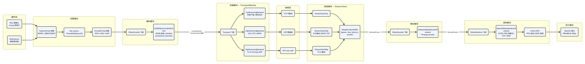
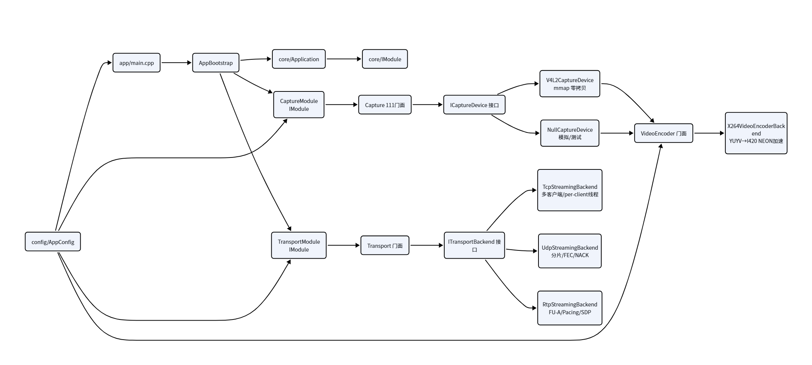
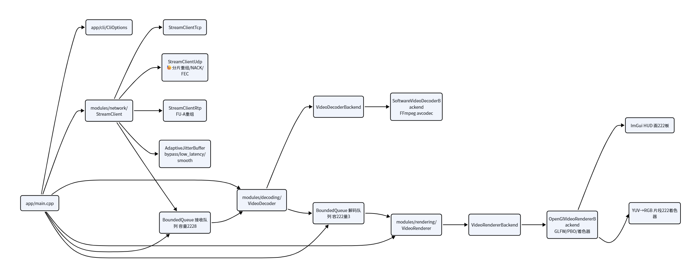
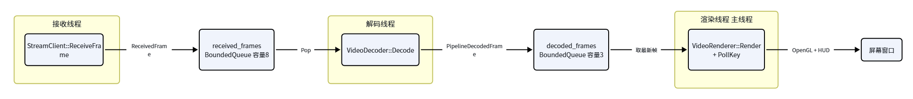
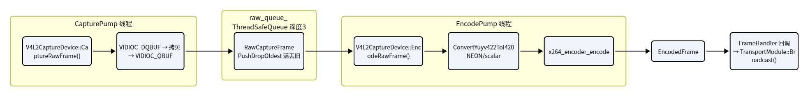
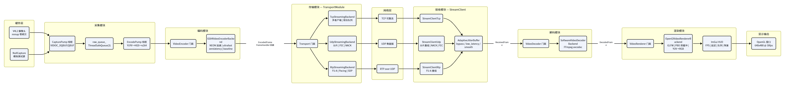
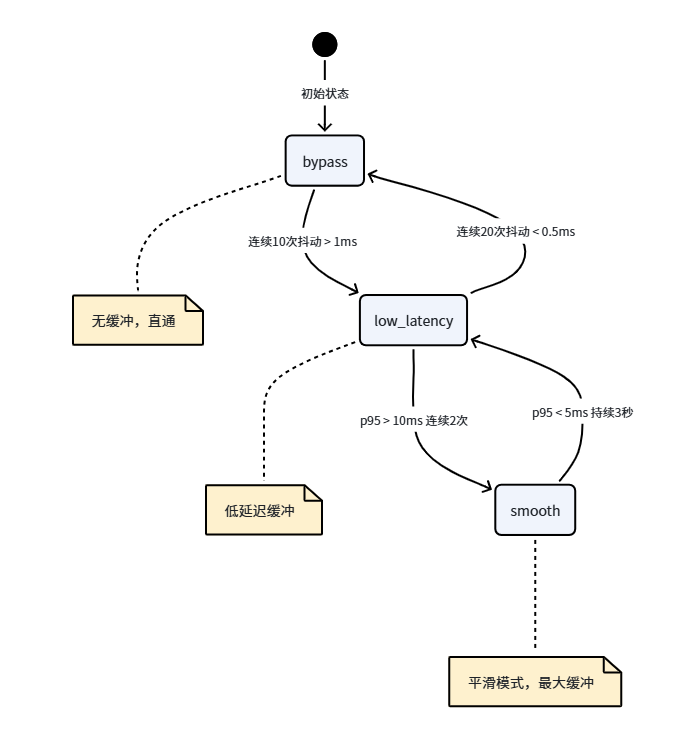
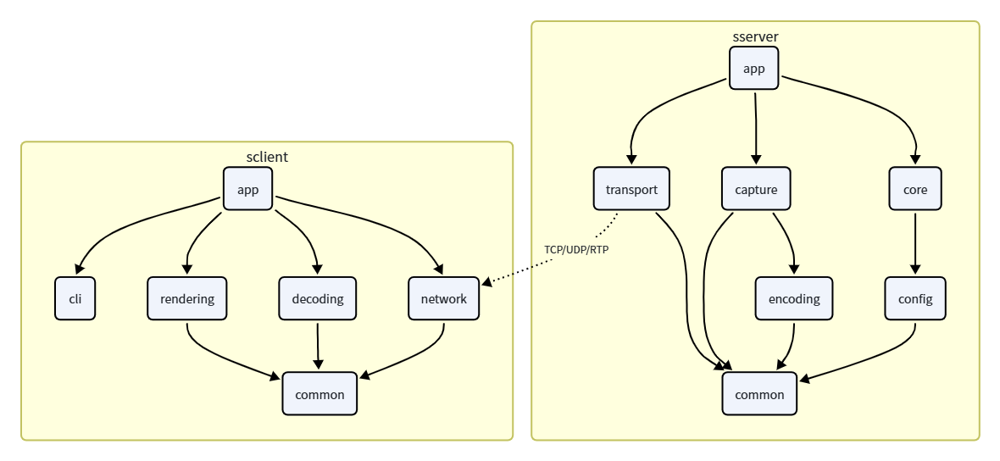

## 1. 项目介绍


**`sserver/`（服务端）：**&#x4E09;层架构：`app/`（入口与启动编排）→ `modules/`（capture/encoding/transport 三大业务模块）→ `common/`（日志/指标/并发队列/网络协议）。支持 **V4L2 真实摄像头**和 **Null 模拟源**两种采集模式；传输层支持 **TCP 流式**、**UDP（分片+FEC+NACK）** 和 **RTP** 三种协议。

TCP 链路实现了多客户端连接管理、可靠有序传输、per-client 发送队列和队列背压策略，适合讲服务端多客户端会话管理、发送线程模型、粘包拆包处理、稳定传输和队列满时的低延时取舍。

UDP 链路实现了帧分片、分片重组、NACK 丢包重传、FEC 前向纠错和自适应 jitter buffer，适合讲弱网环境下的网络抖动、丢包恢复、乱序处理和实时性优化。

RTP 链路实现了 H.264 Annex-B 码流解析、NALU 拆分、FU-A 分片、RTP 包发送、SDP 描述文件生成和 pacing 节奏控制，适合讲标准流媒体协议、H.264 over RTP、RTP 时间戳、分片打包和客户端 RTP 接收重组。


**`sclient/`（客户端）：**&#x540C;样三层架构，三线程管线：**接收线程**（TCP/UDP/RTP 收包 + 自适应抖动缓冲 + FEC/NACK 恢复）→ **解码线程**（FFmpeg H.264 解码）→ **渲染线程**（OpenGL + GLFW + ImGui HUD 叠加显示）。HUD 实时展示**端到端延时百分位、帧率、丢包率、FEC 恢复率、jitter buffer**等指标。


**端到端数据链路（全貌）：**

```plain&#x20;text
V4L2 摄像头采集 → YUYV422 原始帧 → x264 H.264 编码 → TCP/UDP/RTP 网络传输
                                                              ↓
                    OpenGL 窗口 + HUD 叠加 ← FFmpeg 解码 ← 客户端接收
```

***

## 2. 技术栈

**低延时视频传输架构**

* 服务端：采集线程 → 编码线程 → 传输线程

* 客户端：接收线程 → 解码线程 → 渲染主线程

**模块解耦设计**

* Capture / Encoder / Transport / Decoder / Renderer 分层拆分

* 门面 + Backend + 工厂模式

* IModule 生命周期统一管理

* Application 负责初始化、启动、停止和失败回滚

**视频采集**

* V4L2 摄像头采集

* YUYV422 原始帧处理

* YUYV422 → I420 像素格式转换

* x264 H.264 编码

* Annex-B 码流组织

**TCP / UDP / RTP 三套传输链路**

* TCP：多客户端连接、per-client 队列、sendmsg 发送

* UDP：自定义分片协议、分片缓存、NACK 重传、FEC XOR 恢复

* RTP：H.264 NALU 拆分、FU-A 分片、SDP 文件生成、pacing 控制

**客户端实时接收与解码**

* TCP 流式接收

* UDP 分片重组

* RTP FU-A 重组

* FFmpeg H.264 软件解码

* OpenGL 纹理上传与实时渲染

**低延时优化思路**

* 有界队列控制延迟

* 队列满时丢旧帧

* 非关键帧可跳过

* 渲染端取最新帧

* UDP 自适应 jitter buffer

* RTP pacing 降低突发发送

**稳定性与容错**

* atomic\_bool 控制线程退出

* 队列 Close 唤醒阻塞线程

* 模块按顺序初始化，按逆序销毁

* 配置文件校验

* 连接失败重试

* 端口、协议、payload、metadata 校验

**可观测性与性能分析**

* 端到端延迟统计

* capture → encode → send → receive → decode → render 时间戳

* p50 / p95 / p99 延迟统计

* HUD 实时显示 FPS、队列深度、丢包率、NACK、FEC、jitter buffer 状态

**测试体系**

* Unit：协议、配置、队列、延迟统计

* Integration：TCP / UDP / RTP 本地链路

* Smoke：最小启动验证

* Benchmark：传输性能与 UDP 抖动测试

* Latency：端到端延迟基准测试

***

## 3. 系统整体架构

```plain&#x20;text
流媒体项目/
├── sserver/                        # 服务端：采集 → 编码 → 发送
│   ├── src/
│   │   ├── app/                    # 程序入口与启动编排
│   │   │   ├── main.cpp            # main()：配置加载、信号处理、主循环
│   │   │   ├── AppBootstrap.h      # 模块创建、数据流绑定
│   │   │   └── AppBootstrap.cpp
│   │   ├── core/                   # 应用生命周期与模块编排框架
│   │   │   ├── IModule.h           # 模块统一接口（init/start/stop/shutdown）
│   │   │   ├── ModuleState.h       # 模块生命周期状态枚举
│   │   │   ├── ApplicationContext.h # 模块间共享上下文
│   │   │   ├── Application.h       # 按序初始化、逆序销毁、失败回滚
│   │   │   └── Application.cpp
│   │   ├── config/                 # 配置模型、加载与校验
│   │   │   ├── AppConfig.h         # 全部配置参数的结构体定义
│   │   │   └── AppConfig.cpp       # .conf 解析（key=value）、Validate()
│   │   ├── common/                 # 无业务语义的基础能力层
│   │   │   ├── log/                # 线程安全日志（Debug/Info/Warn/Error）
│   │   │   ├── metrics/            # LatencyRecorder：纳秒级延迟百分位统计
│   │   │   ├── concurrency/        # ThreadSafeQueue：阻塞/丢弃/选择性丢弃
│   │   │   ├── model/              # EncodedFrame 核心数据载体
│   │   │   ├── net/                # 网络协议结构（MessageHeader、RTP、H264AnnexB）
│   │   │   └── time/               # MonotonicNowNs() 单调时钟
│   │   └── modules/                # 业务能力模块
│   │       ├── capture/video/      # V4L2 / Null 采集 + 编码线程
│   │       │   ├── ICaptureDevice.h
│   │       │   ├── Capture.h/.cpp  # 门面
│   │       │   ├── CaptureModule.h/.cpp  # IModule 实现
│   │       │   ├── null/           # NullCaptureDevice（模拟源）
│   │       │   └── v4l2/           # V4L2CaptureDevice（真实摄像头）
│   │       ├── encoding/video/     # x264 软件编码
│   │       │   ├── VideoEncoderBackend.h  # 抽象接口
│   │       │   ├── VideoEncoder.h/.cpp   # 门面 + 工厂
│   │       │   └── x264/           # X264VideoEncoderBackend（NEON/scalar YUV→I420）
│   │       └── transport/          # 流传输模块
│   │           ├── ITransportBackend.h    # 抽象接口
│   │           ├── Transport.h/.cpp      # 门面 + 工厂
│   │           ├── TransportModule.h/.cpp # IModule 实现
│   │           ├── tcp/            # TcpStreamingBackend + TcpClientSession
│   │           ├── udp/            # UdpStreamingBackend（分片/FEC/NACK）
│   │           └── rtp/            # RtpStreamingBackend + RtpPacketizer
│   ├── config/                     # 25 个 .conf 配置文件
│   ├── scripts/                    # build.sh / test.sh / tcp.sh / udp.sh / rtp.sh
│   ├── tests/                      # 测试体系（smoke/integration/unit/benchmark/latency）
│   └── docs/                       # 架构文档与启动指南
│
├── sclient/                        # 客户端：接收 → 解码 → 渲染
│   ├── src/
│   │   ├── app/                    # 程序入口与管线编排
│   │   │   ├── main.cpp            # 三线程管线（接收/解码/渲染）
│   │   │   └── cli/                # CLI 参数解析（getopt_long）
│   │   ├── common/                 # 公共基础层
│   │   │   ├── concurrency/        # BoundedQueue（有界线程安全队列）
│   │   │   ├── log/                # 控制台 + 文件日志
│   │   │   ├── media/              # DecodedFrame 解码帧结构
│   │   │   ├── metrics/            # LatencyStats（环形缓冲、百分位）
│   │   │   ├── net/                # H264AnnexB、RTP 协议、SDP 解析
│   │   │   └── protocol/           # 应用层协议定义（MessageHeader、分片、NACK）
│   │   └── modules/                # 业务模块层
│   │       ├── network/            # 网络接收（TCP/UDP/RTP、jitter buffer、NACK/FEC）
│   │       │   ├── StreamClient.h/.cpp       # 统一接收接口
│   │       │   ├── StreamClientTcp.cpp       # TCP 流式接收
│   │       │   ├── StreamClientUdp.cpp       # UDP 分片重组/NACK/FEC
│   │       │   ├── StreamClientRtp.cpp       # RTP 接收/FU-A 重组
│   │       │   ├── AdaptiveJitterBuffer.h    # 自适应抖动缓冲
│   │       │   └── types/                    # ClientConfig/ReceivedFrame/UdpReceiveStats
│   │       ├── decoding/          # H.264 解码（FFmpeg 软件解码）
│   │       │   ├── VideoDecoder.h/.cpp      # 统一接口 + 工厂
│   │       │   ├── VideoDecoderBackend.h     # 抽象基类
│   │       │   └── software/                # SoftwareVideoDecoderBackend
│   │       └── rendering/         # OpenGL 渲染 + ImGui HUD
│   │           ├── VideoRenderer.h/.cpp     # 统一接口 + 工厂
│   │           ├── VideoRendererBackend.h   # 抽象基类
│   │           └── opengl/                   # OpenGlVideoRendererBackend + HUD + shaders
│   ├── scripts/                    # 启动脚本（tcp.sh / udp.sh / rtp.sh / udp_profile.sh）
│   ├── tests/                      # 测试体系（unit/integration/smoke/benchmark）
│   └── docs/                       # 架构文档

```

### 3.1 架构分层

两个子项目都遵循严格的**三层架构**，依赖方向单向：

```plain&#x20;text
Application Layer（应用入口层）
      ↓ 仅依赖
Business Module Layer（业务模块层）
      ↓ 仅依赖
Common Infrastructure Layer（公共基础层）
```



> 上图以**数据流**为线索，从左到右串联了从摄像头采集到屏幕渲染的完整链路。每个大色块代表一个功能域，域内是具体的模块和线程。网络层横跨服务端与客户端，TCP/UDP/RTP 三种传输路径清晰可辨。

### 3.2 服务端架构（sserver）





### 3.3 客户端架构（sclient）



***

## 4. 三线程管线模型（客户端核心）



客户端 `main.cpp` 创建三个线程形成流水线，用两个有界队列连接：

**关键设计：**

| 特性   | 说明                                                |
| ---- | ------------------------------------------------- |
| 背压控制 | 解码线程在 `decoded_frames` 满且当前帧非 IDR 时跳过             |
| 丢弃策略 | 队列满时 `PushOrDropOldest()`，不阻塞生产者                  |
| 停止机制 | `atomic_bool` + `BoundedQueue::Close()` 通知所有消费者退出 |
| 自动重连 | 接收失败后最多重试 10 次，间隔 1 秒                             |

***

## 5. 服务端数据链路（采集→编码→发送）

### 5.1 双线程采集架构（V4L2 设备）



### 5.2 三种传输后端对比



***

## 6. 自定义应用层协议

### 6.1 协议栈总览

```plain&#x20;text
┌─────────────────────────────────────────┐
│        H.264 Annex-B 码流 (payload)       │
├─────────────────────────────────────────┤
│  FrameDiagnosticMetadata (可选, 40字节)   │
│  sequence + capture/encode/send 时间戳    │
├─────────────────────────────────────────┤
│   UDP: UdpFrameFragmentHeader (56字节)    │
│   RTP: RtpHeader + LatencyExtension       │
├─────────────────────────────────────────┤
│        MessageHeader (12字节)             │
│   魔数 "CCTC" + type + sub_type + length  │
├─────────────────────────────────────────┤
│           UDP / TCP 传输层                │
└─────────────────────────────────────────┘
```

### 6.2 MessageHeader（12 字节，所有消息的统一头部）

```plain&#x20;text
Offset  Size  Field
0       4     head_id[4]     魔数 "CCTC"
4       2     message_type   0=KeepAlive  1=AvStream  2=UdpNack
6       2     sub_type       子类型（StreamPayloadType）
8       4     payload_length 后续载荷的总长度
```

### 6.3 UDP 分片格式

```plain&#x20;text
UDP Datagram:
┌──────────────────┬──────────────────────────┬──────────────┐
│  MessageHeader   │  UdpFrameFragmentHeader  │  fragment     │
│  (12 bytes)      │  (56 bytes)              │  payload      │
└──────────────────┴──────────────────────────┴──────────────┘

UdpFrameFragmentHeader 关键字段：
- frame_sequence        帧序号
- frame_payload_size    整帧总大小
- fragment_offset       本分片在帧内偏移
- fragment_index / fragment_count  分片序号/总数
- fragment_role         0=Data  1=XorParity (FEC)
- capture/encode/send timestamps   延迟诊断元数据
```

### 6.4 NACK 与 FEC 机制

```plain&#x20;text
NACK（丢包重传）：
  客户端检测到分片缺失 → 发送 UdpNackHeader + UdpNackItem[]
  → 服务端从 retransmit_cache_ 查找分片 → 重新 sendto()

FEC（前向纠错）：
  服务端对所有 data 分片做 XOR → 生成 1 个 parity 分片
  客户端恰好缺失 1 个分片时 → 用 parity XOR 其余分片恢复
  开消：每帧额外 1 个分片

策略组合：
  NACK only  → 大分片(65000)，丢包时重传
  FEC only   → 小分片(1000)，丢 1 个自动恢复
  FEC + NACK → 小分片(256)，FEC 先恢复，恢复不了再 NACK
```

***

## 7. 传输模式对比

| 特性         | TCP                       | UDP                        | RTP             |
| ---------- | ------------------------- | -------------------------- | --------------- |
| **连接方向**   | 客户端→服务端                   | 客户端→服务端                    | 服务端→客户端         |
| **传输保证**   | 可靠有序                      | 不可靠无序                      | 不可靠无序           |
| **分片机制**   | 无（流式）                     | 自定义 UdpFrameFragmentHeader | RTP FU-A        |
| **丢包恢复**   | 无需（TCP 保证）                | NACK + FEC                 | 无（依赖网络）         |
| **延迟诊断**   | MessageHeader 嵌入 metadata | 分片头嵌入时间戳                   | 自定义延迟扩展头 0x5353 |
| **服务器角色**  | 被动监听                      | 被动监听                       | 主动推送            |
| **多客户端**   | accept 多连接                | KeepAlive 注册               | 单播（当前）          |
| **典型端口**   | 19099                     | 19100/19101/19102          | 19504/19514     |
| **SDP 支持** | 否                         | 否                          | 是（自动生成）         |

***

## 8. 自适应抖动缓冲（AdaptiveJitterBuffer）



客户端 UDP/RTP 接收时，根据网络质量自动切换缓冲策略：

| 模式           | 行为             | 适用场景        |
| ------------ | -------------- | ----------- |
| bypass       | 帧立即输出，无缓冲      | 本地回环、有线 LAN |
| low\_latency | 轻量缓冲，目标延迟 8ms  | 轻微抖动网络      |
| smooth       | 较大缓冲，最大等待 40ms | 高抖动网络       |

***

## 9. 观测与诊断体系

### 9.1 HUD 实时面板（ImGui 叠加）

```plain&#x20;text
┌─ sclient HUD ──────────────────────┐
│ Transport: UDP  │  Resolution: 640x480│
│ FPS: 30.0       │  Connected: YES     │
├─ Latency ───────────────────────────┤
│ capture→render:   12.5 ms            │
│ network→receive:   3.2 ms            │
│ receive→decode:    0.8 ms            │
│ decode time:       1.5 ms            │
│ decode→render:     2.1 ms            │
├─ Queues ────────────────────────────┤
│ receive queue:  2/8                  │
│ decode queue:   1/3                  │
│ fragment loss:  0.0%                 │
├─ Jitter Buffer ─────────────────────┤
│ strategy: auto  mode: low_latency    │
│ quality: good   depth: 2             │
│ target delay: 8ms                    │
│ jitter p50: 0.3ms  p95: 1.2ms       │
├─ Recovery ──────────────────────────┤
│ NACK: on  FEC: on                    │
│ NACK sent: 12  FEC recovered: 3      │
└─────────────────────────────────────┘
```

### 9.2 延迟统计

系统在多个节点打时间戳，实现全链路延迟追踪：

```plain&#x20;text
采集时间戳 → 编码开始/结束 → 发送时间戳 → 网络传输 → 接收时间戳 → 解码开始 → 解码完成 → 渲染
   │              │              │              │            │          │           │
   └── capture_to_encode_start ──┘              │            │          │           │
   │                                             │            │          │           │
   └──────────── capture_to_send ────────────────┘            │          │           │
   │                                                          │          │           │
   └─────────────────── capture_to_receive ───────────────────┘          │           │
   │                                                                     │           │
   └────────────────────────── capture_to_decode ────────────────────────┘           │
   │                                                                                 │
   └────────────────────────────────── capture_to_render ────────────────────────────┘
```

每 120 帧自动输出一次延迟百分位摘要（min/avg/p50/p95/p99/max）。

***

## 10. 模块间依赖关系



**依赖规则：**

* `common` 层不依赖任何业务模块，仅依赖 C++ 标准库和系统 API

* `core` 层定义接口（IModule），`modules` 层实现接口

* `app` 层负责将 `modules` 组装在一起

* 业务模块之间通过 `ApplicationContext` 共享配置，通过 `FrameHandler` 回调传递数据，不直接依赖彼此私有实现

***

## 11. 核心设计模式

| 模式                    | 应用位置                                                                         | 说明                                     |
| --------------------- | ---------------------------------------------------------------------------- | -------------------------------------- |
| **门面 + Backend + 工厂** | sserver: Capture/Transport/VideoEncoder; sclient: VideoDecoder/VideoRenderer | 统一对外接口，工厂创建具体实现                        |
| **IModule 生命周期**      | sserver: CaptureModule/TransportModule                                       | 统一 init→start→stop→shutdown，支持失败回滚     |
| **生产者-消费者**           | sclient: 三线程管线                                                               | 接收→解码→渲染，BoundedQueue 连接               |
| **观察者**               | sserver: FrameHandler 回调                                                     | CaptureModule 产出帧 → TransportModule 广播 |
| **策略模式**              | sserver: queue\_drop\_policy; sclient: jitter buffer strategy                | 运行时切换行为                                |
| **双缓冲**               | sclient: PBO 纹理上传                                                            | 交替使用两个 PBO 减少 GPU 等待                   |

***

## 12. 测试体系

两个子项目均建立了**五层测试金字塔**：

```plain&#x20;text
         ┌──────┐
         │ E2E  │  ← 联调脚本（scripts/）
        ┌┴──────┴┐
        │ Latency│  ← 端到端延迟基准（sserver 独有）
       ┌┴────────┴┐
       │ Benchmark │  ← 传输/性能基准测试
      ┌┴──────────┴┐
      │ Integration │  ← 本地 loopback 端到端链路
     ┌┴────────────┴┐
     │     Unit      │  ← 协议解析、配置校验、纯逻辑
     └──────────────┘
```

| 层级          | sserver 覆盖                                         | sclient 覆盖                   | 硬件依赖    |
| ----------- | -------------------------------------------------- | ---------------------------- | ------- |
| Unit        | RTP 协议、UDP/RTP 配置校验、FEC 恢复、生命周期回滚、延迟统计             | CLI 解析、队列、延迟统计、RTP 协议、SDP 解析 | 无       |
| Integration | TCP/UDP/RTP 端到端（null capture + transport + client） | TCP/UDP/RTP loopback 收发      | 无       |
| Smoke       | 配置加载 + 模块生命周期（TCP/UDP）                             | 最少 RTP 接收 + 解码链路（进程内）        | 无       |
| Benchmark   | 120 帧分阶段延迟统计                                       | UDP 抖动/延迟观测                  | 无       |
| Latency     | FFmpeg 解码 + OpenCV 渲染（补充 decode/present\_ready）    | —                            | V4L2 可选 |

**运行方式：**

```bash
# 全量测试
ctest --test-dir build --output-on-failure

# 按标签筛选
ctest -L unit        # 单元测试
ctest -L integration # 集成测试
ctest -L smoke       # 冒烟测试
ctest -L benchmark   # 基准测试
```

***

## 13. 编译与运行

### 13.1 系统依赖

```bash
# 服务端依赖
sudo apt install -y build-essential cmake pkg-config \
  libx264-dev libavcodec-dev libavutil-dev libswscale-dev \
  libopencv-dev ffmpeg v4l-utils

# 客户端额外依赖
sudo apt install -y libglfw3-dev libgl-dev
```

### 13.2 构建

```bash
# 服务端
cd sserver && cmake -S . -B build && cmake --build build -j

# 客户端
cd sclient && cmake -S . -B build && cmake --build build -j
```

### 13.3 联调示例

```bash
# ===== TCP 模式 =====
# 终端1：服务端
cd sserver && ./scripts/tcp.sh
# 终端2：客户端
cd sclient && ./scripts/tcp.sh

# ===== UDP 模式 =====
# 终端1：服务端 
cd sserver && ./scripts/udp.sh
# 终端2：客户端 
cd sclient && ./scripts/udp.sh

# ===== RTP 模式 =====
# 终端1：服务端 
cd sserver && ./scripts/rtp.sh v4l2
# 终端2：客户端 
cd sclient && ./scripts/rtp.sh v4l2
```

***

## 14. 关键配置参数速查

### 14.1 sserver 核心配置

```ini
# 采集
capture.source = v4l2          # v4l2 / null
capture.device = /dev/video0
capture.width = 640
capture.height = 480
capture.fps = 30

# 编码
codec.backend = x264
codec.x264_preset = ultrafast
codec.x264_tune = zerolatency
codec.x264_profile = baseline

# 传输
transport.backend = tcp        # tcp / udp / rtp
transport.listen_port = 9999
transport.embed_frame_metadata = true

# UDP 特化
transport.udp_enable_nack = false
transport.udp_enable_fec = false
transport.udp_target_payload_size = 65000

# TCP 特化
transport.max_pending_frames = 3
transport.queue_drop_policy = drop_oldest_non_key
```

### 14.2 sclient 核心 CLI 参数

```bash
--transport tcp|udp|rtp    # 传输协议
--host 127.0.0.1           # 服务端地址
--port 9999                # 端口
--decoder auto|software    # 解码后端
--renderer auto|opengl     # 渲染后端
--vsync on|off             # 垂直同步
--receive-queue 8          # 接收队列容量
--decode-queue 3           # 解码队列容量
--sdp <file>               # SDP 文件（RTP 模式）
```
