# 第一章：音视频整体链路

音视频开发的核心任务，是把现实世界中的声音和画面，变成计算机可以处理、压缩、传输、存储和播放的数据。

一条完整的音视频链路通常包含七个核心环节：

采集 -> 编码 -> 封装 -> 传输 -> 解封装 -> 解码 -> 渲染

这条链路看起来很长，但本质上只做三类事情：

1. 获取数据：从摄像头、麦克风拿到原始音视频数据。

2. 处理数据：压缩、打包、传输、拆包、还原数据。

3) 展示数据：把还原后的图像显示出来，把声音播放出来。

学习音视频开发时，不建议一开始就陷入某个协议或某个平台的细节。更合理的方式是先建立完整链路意识，再逐个模块深入。

## 1.1 七个核心环节

| 环节  | 输入      | 输出                   | 核心作用      |
| --- | ------- | -------------------- | --------- |
| 采集  | 摄像头、麦克风 | YUV、RGB、PCM          | 获取原始音视频数据 |
| 编码  | YUV、PCM | H.264、H.265、AAC、Opus | 压缩数据      |
| 封装  | 编码后码流   | MP4、TS、FLV、RTP包      | 组织数据和时间信息 |
| 传输  | 文件或网络包  | 对端可接收数据              | 发送或存储     |
| 解封装 | 容器或协议包  | H.264、AAC等码流         | 拆出真实码流    |
| 解码  | 压缩码流    | YUV、PCM              | 还原原始数据    |
| 渲染  | YUV、PCM | 画面、声音                | 显示和播放     |

## 1.2 基本链路理解

以实时视频通话为例，数据会经历下面的过程：

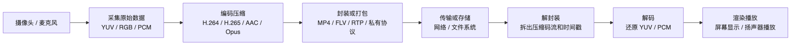

1. 摄像头采集画面

2. 得到原始图像帧，比如 YUV

3. 编码器压缩成 H.264 或 H.265

4. 按网络协议打包，比如 RTP 或私有 UDP 包

5. 通过网络发送给接收端

6. 接收端解析协议包并重组码流

7. 解码器还原出 YUV 图像

8. 渲染模块把图像显示到屏幕


音频链路也是同样思路：

麦克风采集声音 -> PCM -> AAC/Opus -> 传输 -> 解码 -> PCM -> 扬声器播放

## 1.3 学习重点

音视频开发最容易出问题的地方，不一定是某个 API 不会调用，而是模块之间的数据格式、时间戳和缓冲队列没有处理好。

需要始终关注三个问题：

1. 数据格式是否正确。

2. 时间顺序是否正确。

3) 队列是否产生了不可控延迟。

# 第二章：采集

## 2.1 采集的核心目标

采集模块负责从硬件设备中获取原始音视频数据。

视频采集通常得到原始图像帧，例如：

* RGB

* YUV420P

* NV12

* NV21

音频采集通常得到原始采样数据，例如：

* PCM 16bit

* 单声道或双声道

* 44100Hz 或 48000Hz 采样率

采集阶段的数据还没有被压缩，体积通常很大。

## 2.2 必学概念

### 分辨率

分辨率表示一帧图像的宽和高，例如 1920x1080。分辨率越高，画面越清晰，但采集、编码、传输和渲染压力都会增加。

### 帧率

帧率表示每秒采集多少帧图像，例如 25fps、30fps、60fps。

帧率越高，画面越流畅，但数据量也越大。

### 码率

码率表示单位时间内的数据量，常用单位是 kbps 或 Mbps。采集阶段一般还没有真正压缩，但后续编码会强烈依赖码率控制。

### 像素格式

像素格式描述一帧图像中颜色数据的组织方式。常见格式包括 RGB、YUV420P、NV12。

音视频开发中，YUV 比 RGB 更常见，因为视频编码器通常更适合处理 YUV 数据。

### 音频格式

音频格式通常包含采样率、采样位深、声道数和采样格式。

例如：

48000Hz / 16bit / stereo / PCM

### 时间戳

时间戳用于描述音视频数据在时间轴上的位置。没有稳定的时间戳，后续就很难保证音视频同步。

### 缓冲区

采集设备通常不会直接把数据交给业务代码，而是通过缓冲区队列传递。业务代码需要从队列中取数据，再把缓冲区重新归还给设备或驱动。

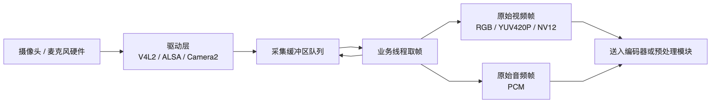

## 2.3 原始视频数据

摄像头采集出来的数据，本质是一帧一帧的图像。图像可以用不同方式表示颜色。

### RGB

RGB 用红、绿、蓝三个分量描述颜色。

常见的 RGB 排列：

```bash
RGBRGBRGB...
```

或者：

```bash
BGRBGRBGR...
```

RGB 很直观，适合屏幕显示和普通图像处理，但不一定适合视频编码。

### YUV

YUV 把颜色拆成亮度和色度：

* Y：亮度，也可以理解为黑白信息。

* U：蓝色色度差。

* V：红色色度差。

人眼对亮度更敏感，对色度没那么敏感。所以视频编码常用 YUV，把亮度保留得更完整，把色度适当降采样，从而减少数据量。

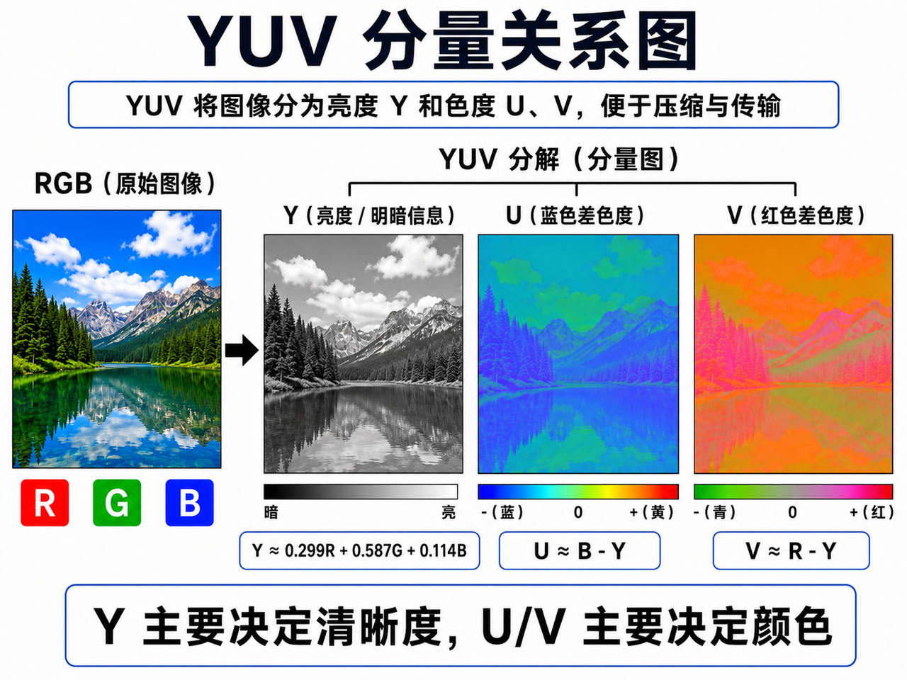

如果只保留 Y 分量，画面仍然能看出轮廓，只是变成黑白图。如果 U/V 出错，画面轮廓可能还在，但颜色会发绿、发紫、发红或整体偏色。

### YUV420&#x20;

YUV420 不是某一种唯一的内存排列方式，而是一种采样比例。

它表示：

* Y 分量保留完整分辨率。

* U 分量在水平和垂直方向都降采样一半。

* V 分量在水平和垂直方向都降采样一半。

也就是说，一个 2x2 的像素块，会有 4 个 Y，但只共享 1 个 U 和 1 个 V。

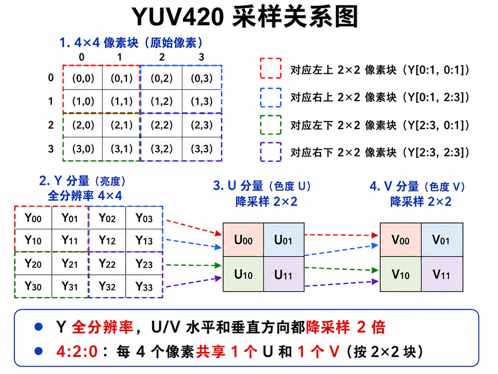

所以 YUV420 的数据量是：

Y: width \* height

U: width \* height / 4

V: width \* height / 4

总大小 = width \* height \* 3 / 2

这就是为什么 YUV420 常说一帧大小是 width \* height \* 1.5。

#### YUV420P

YUV420P 中的 P 是 Planar，意思是平面格式。

它的内存布局是：

先放完整 Y 平面

再放完整 U 平面

最后放完整 V 平面

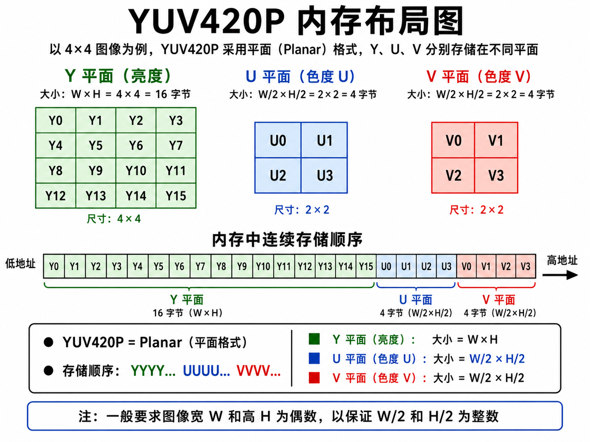

YUV420P 常见别名：

* I420：Y、U、V 顺序。

* YV12：Y、V、U 顺序。

注意：I420 和 YV12 都是 YUV420P 这一类平面格式，但 U/V 平面顺序相反。如果把 YV12 当 I420 处理，画面通常会明显偏色。

#### NV12

NV12 也是 YUV420，但它不是三个平面分开存放，而是两个平面：

Y 平面 + UV 交错平面

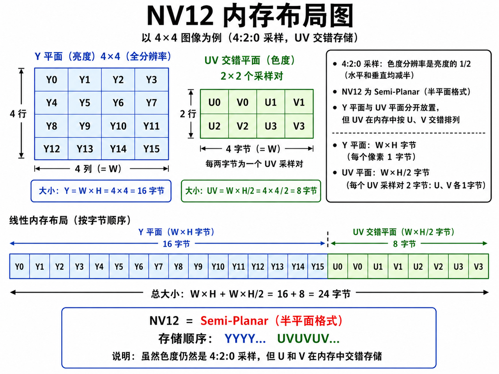


##### NV12 和 NV21 的区别

NV12 和 NV21 都是 YUV420 semi-planar 格式，区别只在 UV 交错顺序。

| 格式   | Y 平面     | 色度平面顺序    |
| ---- | -------- | --------- |
| NV12 | YYYYY... | UVUVUV... |
| NV21 | YYYYY... | VUVUVU... |

Android 相机里经常能遇到 NV21。硬件解码器、桌面硬解、GPU 管线里经常能遇到 NV12。

如果把 NV21 当 NV12 处理，U/V 会反，画面常见现象是：

* 人脸颜色异常。

* 红色和蓝色倾向不对。

* 画面发紫、发绿。

#### YUV420P 和 NV12 的区别

| 格式      | 存储方式             | 常见场景            |
| ------- | ---------------- | --------------- |
| YUV420P | Y、U、V 三个平面分开     | 软件编解码、FFmpeg 常见 |
| NV12    | Y 一个平面，UV 交错一个平面 | 硬件编解码、GPU 渲染常见  |

从数据量上看，YUV420P 和 NV12 一样，都是：

width \* height \* 1.5

不同点不是大小，而是内存排列方式。

### stride 和 linesize：真实开发里不能只看 width

真实开发中，一行图像数据不一定正好等于 width 字节。很多采集设备、硬件解码器、GPU 纹理会为了内存对齐，在每行末尾加 padding。

这时要看 stride 或 linesize。

例如画面宽度是 1920，但硬件输出的 Y 平面 stride 可能是 2048：

* 可见宽度: 1920

* 内存行跨度: 2048

* 每行末尾 padding: 128 字节

读取图像时不能简单按 width 连续读完整帧，否则下一行会错位。

正确理解：

* width  决定有效画面宽度

* height 决定有效画面高度

* stride 决定内存里每一行跨多少字节

### 常见排查方法

如果你拿到一帧 YUV 数据，可以按下面顺序判断格式是否正确：

1. 先确认宽高和总数据大小。

2. 如果大小接近 width \* height \* 1.5，大概率是 YUV420。

3) 再确认是 planar 还是 semi-planar。

4) 如果是 planar，确认顺序是 I420 还是 YV12。

5. 如果是 semi-planar，确认顺序是 NV12 还是 NV21。

6. 检查 stride 是否等于 width。

7) 用 FFmpeg 或自写工具把 YUV 转成 PNG 验证颜色。

常见 FFmpeg 验证命令：

```bash
ffmpeg -s 1920x1080 -pix_fmt yuv420p -i input.yuv output.png
```

如果是 NV12：

```bash
ffmpeg -s 1920x1080 -pix_fmt nv12 -i input.yuv output.png
```

如果同一份数据用 yuv420p 解析颜色不对，但用 nv12 正常，说明原始数据很可能不是 YUV420P，而是 NV12。

如果渲染时颜色发紫、发绿、发灰，常见原因就是把 YUV420P、NV12、NV21 当成同一种格式处理了。

## 2.4 原始音频数据

PCM 是最常见的原始音频格式。它表示声音波形在时间上的采样值。

一个 PCM 格式通常由四个要素决定：

采样率 + 采样位深 + 声道数 + 存储格式

例如：

48000Hz / 16bit / 2 channels / signed little-endian

含义是：

* 每秒采样 48000 次。

* 每个采样点 16bit，也就是 2 字节。

* 双声道。

* 小端有符号整数存储。

一秒 PCM 数据大小：

采样率 \* 单个采样字节数 \* 声道数

例如 48000Hz / 16bit / stereo：

48000 \* 2 \* 2 = 192000 字节/秒

约等于 187.5KB/s。

音频数据比原始视频小很多，但音频对连续性非常敏感。轻微卡顿、丢样、时间戳跳变，都很容易被听出来。

## 2.5 常见接口

| 平台        | 视频采集                        | 音频采集                    |
| --------- | --------------------------- | ----------------------- |
| Linux     | V4L2                        | ALSA                    |
| Windows   | DirectShow、Media Foundation | WASAPI、Media Foundation |
| Android   | Camera API、Camera2          | AudioRecord             |
| iOS/macOS | AVFoundation                | AVFoundation            |

## 2.6 常见问题

完成采集模块时，至少要做下面几件事：

1. 枚举摄像头和音频设备。

2. 设置分辨率、帧率和像素格式。

3) 获取一帧原始图像。

4) 获取一段原始音频数据。

5. 理解采集缓冲区的排队机制。

6. 尽量减少不必要的数据拷贝。

采集阶段常见的问题包括：

* 驱动支持的格式和目标格式不一致。

* 采集时间戳不稳定。

* 缓冲队列积压导致延迟升高。

* 颜色格式转换带来额外开销。

* 数据拷贝太多导致 CPU 占用升高。

采集模块的第一目标不是写出复杂架构，而是稳定拿到格式正确、时间戳正确的数据。

# 第三章：编码

## 3.1 编码的核心目标

编码的目标是压缩原始音视频数据，减少带宽占用和存储空间。

未经压缩的视频数据非常大。以 1920x1080、30fps、YUV420P 为例，一帧大约 3MB，每秒接近 90MB。这样的数据无法直接用于普通网络传输。

编码器的作用就是把这些原始数据压缩成 H.264、H.265、AV1、AAC、Opus 等格式。

## 3.2 视频编码为什么能压缩

视频编码能压缩数据，主要依赖三个事实：

1. 一帧图像内部有大量相似区域。

2. 相邻帧之间变化通常不大。

3) 人眼对某些细节不敏感，可以适当丢弃。

所以视频编码器不会把每一帧完整保存下来，而是会做下面几件事：

1. 原始图像

2. 帧内预测或帧间预测

3. 得到预测残差

4. 变换

5. 量化

6. 熵编码

7. 输出压缩码流

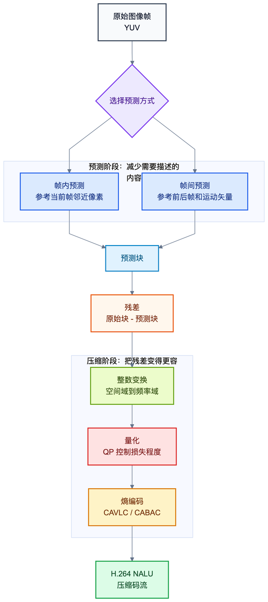


## 3.3 H.264 编码原理

H.264 的目标是用尽可能少的比特表示一段视频，同时让解码后的画面尽量接近原始画面。

它的基本思路不是“保存图像本身”，而是“保存预测方式和预测误差”。

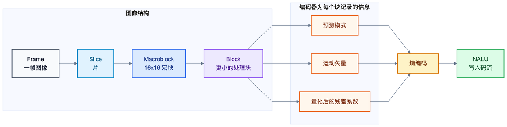

### 编码基本单位

H.264 里常见的图像组织层级是：

Sequence -> GOP -> Frame -> Slice -> Macroblock -> Block

可以简单理解为：

* 一段视频由很多帧组成。

* 一帧可以被切成一个或多个 Slice。

* Slice 里面包含很多宏块。

* 宏块再拆成更小的块做预测、变换和量化。

H.264 中经典宏块大小是 16x16。编码器会围绕这些块去判断：这一块应该直接参考本帧周围像素，还是参考前后帧中已经出现过的内容。

### 帧内预测

帧内预测只使用当前帧内部已经编码过的像素进行预测。

比如一块墙面颜色比较接近，编码器不需要保存每个像素的完整值，只需要告诉解码器：

这一块可以根据左边或上边的像素推出来

然后再保存预测不准的那部分误差。

帧内预测主要用于 I帧。它的好处是可以独立解码，坏处是压缩率通常不如帧间预测。

### 帧间预测

帧间预测会参考其他帧。

比如视频中一个人从左向右移动，当前帧里的人和上一帧里的人非常像，只是位置变了。编码器就可以记录：

这一块内容来自上一帧的某个位置，向右移动了多少

这个“移动了多少”就是运动矢量。编码器再保存预测误差，就能大幅减少数据量。

P帧和 B帧主要依赖帧间预测。

### 残差

预测不可能完全准确。原始块和预测块之间的差值叫残差。

残差 = 原始图像块 - 预测图像块

编码器真正需要保存的，往往不是原始图像块，而是：

预测模式 + 运动矢量 + 残差

如果预测足够准，残差就很小，压缩率就高。

### 变换

残差仍然是像素域数据，不适合直接压缩。编码器会对残差做类似 DCT 的整数变换，把数据从空间域变到频率域。

可以简单理解为：

* 低频部分表示大面积平滑变化。

* 高频部分表示边缘、纹理、噪声等细节。

人眼对低频更敏感，对部分高频细节没那么敏感。编码器后面会利用这一点做量化。

### 量化

量化是视频编码里最关键的有损压缩步骤。

它会把变换后的系数按一定步长进行压缩。步长越大，很多细节系数就会变成 0，码流变小，但画质下降。

这一步和 QP 强相关。

### 熵编码

经过量化后，很多系数会变成 0，数据会出现明显规律。熵编码负责把这些符号用更短的二进制表示。

H.264 常见熵编码方式包括：

* CAVLC

* CABAC

CABAC 压缩率通常更高，但计算复杂度也更高。

## 3.4 I帧、P帧、B帧和 GOP

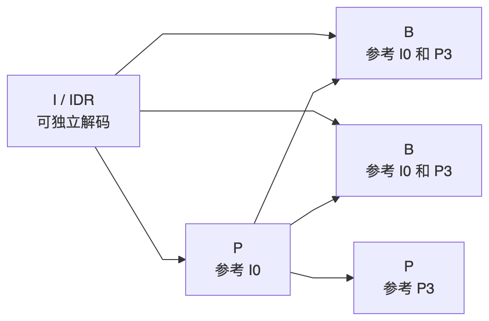

### I帧

I帧是完整帧，可以独立解码。播放器通常需要从 I帧 或 IDR帧 开始才能稳定出图。

### P帧

P帧依赖前面的参考帧，只保存相对变化。它比 I帧 小，但不能完全独立解码。

### B帧

B帧可能同时参考前后帧，压缩率更高，但会带来重排序延迟。低延迟场景通常会减少或禁用 B帧。

### GOP

GOP 是一组连续的视频帧，通常从一个关键帧开始。GOP 越长，压缩效率可能越高，但随机访问和错误恢复能力会变差。

### SPS 和 PPS

SPS 和 PPS 是 H.264/H.265 中非常重要的参数集，描述了解码所需的基础信息。如果接收端没有拿到正确的 SPS/PPS，可能会黑屏、花屏或直接解码失败。

### IDR

IDR 是一种特殊关键帧。解码器遇到 IDR 后，可以清空之前的参考关系，从这里重新开始解码。

## 3.5 QP：量化参数

QP 是 Quantization Parameter 的缩写，中文通常叫量化参数。

QP 决定量化步长，直接影响画质、码率和压缩强度。

可以先记住这个结论：

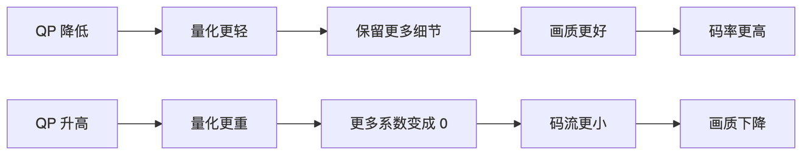

QP 越小 -> 量化越轻 -> 画质越好 -> 码率越高 -> 文件更大

QP 越大 -> 量化越重 -> 画质越差 -> 码率越低 -> 文件更小

H.264 中常见 QP 范围是 0-51。

| QP 范围 | 大致效果   | 常见感受             |
| ----- | ------ | ---------------- |
| 0-18  | 质量很高   | 码率高，接近无损或高质量     |
| 19-28 | 常用质量区间 | 清晰度和码率比较平衡       |
| 29-36 | 压缩明显   | 细节减少，可能开始糊       |
| 37-51 | 压缩很重   | 容易出现块效应、马赛克、细节丢失 |

这不是绝对标准，因为画面内容、分辨率、帧率、编码器实现都会影响结果。

### QP 为什么影响码率

量化可以理解成“把细节按粗粒度取整”。

假设变换后有一些系数：

```bash
105, 28, 9, 3, 1
```

如果量化步长小，量化后可能仍然保留很多细节：

```bash
52, 14, 4, 1, 1
```

如果量化步长大，小系数可能直接变成 0：

```bash
10, 3, 1, 0, 0
```

0 越多，熵编码越容易压缩，码流就越小。但这些被丢掉的系数往往对应纹理、边缘和细节，所以画质会下降。

### QP 不是越低越好

QP 太低会带来几个问题：

* 码率过高，网络传不动。

* 编码器压力变大。

* 解码器和渲染压力可能上升。

* 实时场景容易造成队列堆积和延迟升高。

实时音视频里，稳定低延迟通常比单帧极致画质更重要。

### 不同帧的 QP

编码器通常不会让所有帧使用完全相同的 QP。

常见策略是：

* I帧比较重要，QP 可能低一些。

* P帧可以适中。

* B帧参考价值较低，QP 可能高一些。

这样可以在总体码率受控的前提下，把更多比特分配给更重要的帧。

## 3.6 码率控制

码率控制就是编码器决定“每一帧应该花多少比特”的过程。

码率控制和 QP 是强绑定关系：

* 目标码率高 -> 编码器倾向使用更低 QP -> 画质更好

* 目标码率低 -> 编码器倾向使用更高 QP -> 码流更小

常见码率控制模式包括：

| 模式  | 含义                          | 适合场景           |
| --- | --------------------------- | -------------- |
| CBR | Constant Bitrate，恒定码率       | 直播、实时传输、带宽固定场景 |
| VBR | Variable Bitrate，可变码率       | 点播、录制、文件压缩     |
| CRF | Constant Rate Factor，恒定质量倾向 | 离线转码、质量优先      |
| CQP | Constant QP，固定 QP           | 测试、画质对比、特殊场景   |

### CBR

CBR 希望码率尽量稳定。它适合网络带宽比较固定的直播和实时通信。

但 CBR 不代表每一帧大小完全一样。画面复杂时，编码器可能提高 QP 来压住码率；画面简单时，编码器可能降低 QP 或产生更小的帧。

### VBR

VBR 允许码率随画面复杂度变化。

画面复杂时多用一些比特，画面简单时少用一些比特。它通常比 CBR 更容易获得稳定画质，但瞬时码率可能较高。

### CRF

CRF 更关注主观质量，常用于 x264/x265 离线转码。

CRF 值越小，质量越高，码率越大。它不适合严格要求固定带宽的实时传输。

### VBV 缓冲区

VBV 可以理解为编码器的码率水库，用来限制码流输出不要超出解码端或网络的承受能力。

如果 VBV 太大，码率波动空间大，可能增加延迟。如果 VBV 太小，编码器会被迫更激进地提高 QP，画质可能明显下降。

## 3.7 H.264 码流结构

H.264 码流由一个个 NALU 组成。

常见 NALU 类型包括：

| NALU 类型       | 含义                          |
| ------------- | --------------------------- |
| SPS           | 序列参数集，描述分辨率、Profile、Level 等 |
| PPS           | 图像参数集，描述熵编码、量化等图像级参数        |
| IDR           | 可作为随机访问点的关键帧                |
| non-IDR Slice | 普通视频片段，通常属于 P帧或 B帧          |
| SEI           | 补充增强信息，可携带时间、HDR 等辅助信息      |

H.264 常见两种存储形式：

### Annex B

Annex B 使用起始码分隔 NALU：

```bash
00 00 00 01 SPS
00 00 00 01 PPS
00 00 00 01 IDR
```

裸 H.264 文件、TS、RTP 场景中常见这种格式。

### AVCC

AVCC 通常使用长度字段标识 NALU 大小：

```bash
长度 + NALU
长度 + NALU
长度 + NALU
```

MP4 里常见这种格式。

如果解码器需要 Annex B，但你送的是 AVCC，或者反过来，就可能出现解码失败。

## 3.8 H.264 NALU 进一步理解

H.264 码流不是一整块连续的“视频文件内容”，而是由很多 NALU 组成。

一个 NALU 大致可以理解为：

NALU Header + NALU Payload

NALU Header 里有类型信息。常见类型：

| type | 含义        |
| ---- | --------- |
| 1    | 非 IDR 图像片 |
| 5    | IDR 图像片   |
| 6    | SEI       |
| 7    | SPS       |
| 8    | PPS       |

如果看到裸 H.264 码流，常见形式是：

```plain&#x20;text
00 00 00 01 67 ...   SPS
00 00 00 01 68 ...   PPS
00 00 00 01 65 ...   IDR
00 00 00 01 41 ...   P帧
```

其中 67 通常表示 SPS，68 通常表示 PPS，65 通常表示 IDR Slice，41 常见于普通非 IDR Slice。

注意：这是经验观察，不应该写死所有判断。严谨做法是解析 NALU Header 的低 5 位：

```bash
nal_unit_type = header & 0x1F
```

## 3.9 SPS/PPS 为什么这么重要

SPS 和 PPS 是解码器理解码流的说明书。

SPS 里通常包含：

* Profile

* Level

* 分辨率相关信息

* 参考帧数量

* 帧场编码信息

PPS 里通常包含：

* 熵编码模式

* Slice 参数

* 量化相关参数

* 去块滤波相关参数

如果没有 SPS/PPS，解码器可能不知道：

* 画面多大。

* 用什么 Profile。

* 用什么熵编码。

* 如何解释后面的 Slice。

所以实时传输时，常见做法是：

* 在推流开始时发送 SPS/PPS。

* 每个 IDR 前重复发送 SPS/PPS。

* 新客户端加入时先等 IDR 和 SPS/PPS。

这样做会增加一点码率，但能显著提高接收端恢复能力。

## 3.10 GOP 长度怎么选

GOP 长度就是两个关键帧之间的间隔。

如果帧率是 30fps，GOP 为 60，表示大约每 2 秒一个关键帧。

GOP 越短：

* 优点：首屏更快，丢包后恢复更快，拖动或切流更友好。

* 缺点：I帧更多，码率更高，压缩效率下降。

GOP 越长：

* 优点：压缩效率更高，平均码率更低。

* 缺点：首屏等待可能更久，丢包后花屏恢复更慢。

常见经验：

| 场景    | GOP 建议        |
| ----- | ------------- |
| 视频会议  | 1 秒左右，甚至更短    |
| 低延迟直播 | 1-2 秒         |
| 普通直播  | 2-4 秒         |
| 点播转码  | 可以更长，按质量和码率权衡 |

## 3.11 Profile 和 Level 怎么理解

Profile 表示编码工具集合。不同 Profile 支持的编码特性不同。

常见 H.264 Profile：

| Profile  | 特点                |
| -------- | ----------------- |
| Baseline | 兼容性好，工具较少，低延迟场景常见 |
| Main     | 支持更多压缩工具，老设备兼容性一般 |
| High     | 压缩效率更高，高清视频常见     |

Level 表示能力上限，限制分辨率、帧率、码率、参考帧数量等。

可以这样理解：

* Profile 决定能用哪些编码工具

* Level 决定最大能编码到什么规模

如果编码参数超过解码端支持的 Level，可能出现设备无法播放、硬解失败或只支持软解。

## 3.12 块效应、马赛克和去块滤波

视频编码按块处理。量化过重时，不同块之间的边界会变得明显，这就是块效应。

常见原因：

* QP 过高。

* 目标码率太低。

* 画面运动太剧烈。

* GOP 太长且中间帧参考关系受损。

* 丢包导致参考帧损坏。

H.264 有去块滤波，用来缓解块边界突兀的问题。但去块滤波不是万能的，如果码率太低或丢包严重，画面仍然会明显变差。

## 3.13 编码延迟来自哪里

编码延迟不只是编码器计算时间，还包括编码器内部为了压缩效率而缓存帧。

常见来源：

| 来源        | 说明              |
| --------- | --------------- |
| B帧重排序     | 需要等待未来参考帧       |
| lookahead | 编码器提前观察后续帧以优化码控 |
| VBV 缓冲    | 平滑码率输出          |
| 线程缓存      | 多线程编码内部排队       |
| 硬件编码队列    | 硬件模块异步处理        |

低延迟优化方向：

* 禁用或减少 B帧。

* 减少 lookahead。

* 使用低延迟 tune。

* 控制编码队列长度。

* 不要让采集帧无限排队等待编码。

## 3.14 常见编码格式

| 类型 | 常见格式  | 典型用途               |
| -- | ----- | ------------------ |
| 视频 | H.264 | 兼容性最好，直播、录制、视频会议常用 |
| 视频 | H.265 | 压缩率更高，适合高分辨率视频     |
| 视频 | AV1   | 新一代编码格式，压缩效率高      |
| 音频 | AAC   | 直播、点播、MP4 文件常用     |
| 音频 | Opus  | 实时通信常用，低延迟表现好      |
| 音频 | MP3   | 兼容性强，但实时场景不算首选     |

## 3.15 常见编码器

软件编码器：

* x264

* x265

* FFmpeg libavcodec

硬件编码器：

* NVIDIA NVENC

* Intel QSV

* VAAPI

* Android MediaCodec

* Apple VideoToolbox

软件编码灵活，兼容性好，但 CPU 占用高。硬件编码性能更好，但平台差异明显，参数支持也不完全一致。

## 3.16 实时编码参数怎么理解

实时场景中常见参数可以这样理解：

| 参数               | 影响                |
| ---------------- | ----------------- |
| bitrate          | 目标码率，决定整体带宽压力     |
| fps              | 帧率，影响流畅度和每秒数据量    |
| gop/keyint       | 关键帧间隔，影响恢复能力和码率   |
| max\_b\_frames   | B帧数量，影响压缩率和延迟     |
| preset           | 编码速度和压缩效率的取舍      |
| tune=zerolatency | x264 低延迟配置，减少内部缓存 |
| profile          | 编码工具集合，影响兼容性      |
| level            | 分辨率、码率、帧率等能力约束    |

低延迟直播或互动场景中，通常会考虑：

* 减少或禁用 B帧。

* 缩短 GOP。

* 控制 VBV 缓冲区。

* 使用低延迟 preset 或 tune。

* 避免编码器内部缓存过多帧。

但这些设置会牺牲一部分压缩效率。低延迟、低码率、高画质三者很难同时做到极致。

## 3.17 常见问题

编码模块需要重点完成：

1. 将 YUV 帧送入编码器。

2. 得到 H.264 或 H.265 码流。

3) 控制关键帧输出。

4) 设置 GOP 长度。

5. 调整低延迟参数。

6. 观察不同 QP 对码率和画质的影响。

7) 对比 CBR、VBR、CRF、CQP 的输出差异。

8) 理解码率、分辨率、帧率是否支持动态修改。

编码阶段常见问题包括：

* 编码延迟太高。

* SPS/PPS 没有正确发送。

* 关键帧没有按预期输出。

* 码率忽高忽低。

* QP 过高导致画面糊、块效应、马赛克。

* QP 过低导致码率过大、网络队列堆积。

* CPU 占用过高。

* 解码端花屏。

* 解码端黑屏。

* 解码器直接报错。

### 码率达不到设置值的排查顺序

优先检查：

1. 当前画面是否太简单。

2. 编码器是否启用了 VBR 或 CRF。

3) VBV 参数是否限制输出。

4) 硬件编码器是否忽略部分参数。

5. 分辨率、帧率和目标码率是否匹配。

排查编码问题时，要先确认码流本身是否正确，再确认封装和传输有没有破坏帧边界。

# 第四章：封装

## 4.1 封装的核心目标

封装不是压缩。封装的作用是把已经编码好的音视频数据组织起来，方便存储、传输和处理。

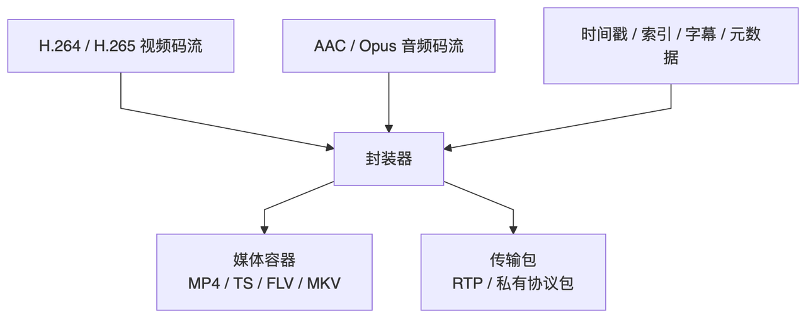

可以这样理解：

编码决定内容长什么样

封装决定内容怎么放进盒子里

例如 H.264 是编码格式，MP4 是封装格式。一个 MP4 文件里面可以放 H.264 视频流，也可以放 AAC 音频流，还可以携带时间戳、索引、字幕等信息。

## 4.2 媒体封装

常见媒体封装格式：

* MP4

* TS

* FLV

* MKV

它们像容器一样组织音视频流，本身不负责压缩数据。

媒体封装重点解决：

* 音视频流怎么组织。

* 时间戳怎么保存。

* 文件头和索引怎么记录。

* 播放器如何快速定位和读取数据。

## 4.3 传输封装

实时传输场景中，常常不会直接发送完整文件，而是把码流拆成适合网络传输的小包。

常见场景包括：

* RTP

* 基于 UDP 的私有协议

传输封装通常会给码流增加协议头，帮助接收端重组数据。

一个私有协议头可能包含：

| 字段    | 作用               |
| ----- | ---------------- |
| 帧号    | 标识当前数据属于哪一帧      |
| 分片序号  | 标识当前分片在一帧中的位置    |
| 总分片数  | 判断一帧是否收齐         |
| 时间戳   | 用于同步和播放控制        |
| 关键帧标记 | 帮助接收端判断是否可以从此处解码 |
| 负载长度  | 标识后续有效数据长度       |

## 4.4 常见问题

封装阶段常见问题包括：

* 封装格式和解封装端不匹配。

* 时间戳处理错误。

* 音视频不同步。

* 关键帧信息丢失。

* 分片边界设计不合理。

封装模块最容易被低估。很多花屏、卡顿、延迟问题，表面发生在解码或播放阶段，根因却是封装时丢失了关键时序信息。

# 第五章：传输

## 5.1 传输的核心目标

传输模块负责把压缩后的音视频数据稳定送到对端，同时尽量降低延迟，控制丢包、抖动和队列积压。

音视频传输不是简单的 send 和 recv。实时场景里，延迟、丢包、乱序、带宽变化都会影响最终体验。

## 5.2 网络基础

必须掌握的网络概念包括：

* TCP

* UDP

* Socket

* MTU

* 分片重组

* 丢包

* 重传

* 延迟

* 抖动

* 带宽

* 阻塞 I/O

* 非阻塞 I/O

* select

* poll

* epoll

其中，TCP 更强调可靠性，UDP 更适合低延迟实时传输，但需要业务层自己处理丢包、乱序和拥塞问题。

## 5.3 常见音视频协议

| 协议       | 主要用途    | 重点能力            |
| -------- | ------- | --------------- |
| RTP/RTCP | 实时媒体传输  | 时间戳、序列号、统计反馈    |
| RTSP     | 流媒体会话控制 | 拉流、播放、暂停等控制     |
| RTMP     | 直播推流和分发 | 直播生态成熟          |
| SRT      | 弱网可靠传输  | 抗丢包、抗抖动         |
| WebRTC   | 实时音视频通信 | 超低延迟、NAT穿透、拥塞控制 |

## 5.4 私有协议需要考虑的问题

如果使用基于 UDP 的私有协议，需要重点设计：

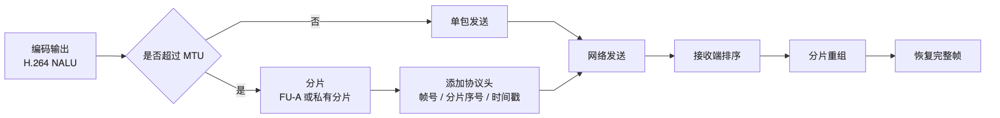

1. H.264 NALU 如何切包。

2. UDP 下如何分片。

3) UDP 下如何组包。

4) 丢包之后是否重传。

5. 自定义协议头包含哪些字段。

6. jitter buffer 如何设计。

7) 时间戳如何传递。

8) 音视频同步如何处理。

## 5.5 RTP 分包：H.264 怎么通过 UDP 发送

UDP 单包不能随便做得很大。以太网常见 MTU 是 1500 字节，扣掉 IP、UDP、RTP 头之后，真正适合承载的负载通常要控制在 1200 字节左右。

如果一个 H.264 NALU 很小，可以直接放入一个 RTP 包。

如果一个 NALU 很大，比如 IDR 帧中的一个 Slice，就需要拆成多个 RTP 包。H.264 over RTP 中常见方式是 FU-A。

FU-A 会把一个大的 NALU 拆成多个分片：

```bash
原始 NALU
    ↓
FU-A start
FU-A middle
FU-A middle
FU-A end
```

接收端需要根据 RTP 序列号和 FU-A 标志重组。

如果中间丢了一个分片，这个 NALU 就不完整。对于视频来说，通常不能把不完整的 NALU 继续送给解码器。

## 5.6 jitter buffer 怎么理解

网络包可能乱序、抖动、延迟变化。jitter buffer 的作用是先缓存一点数据，再按正确顺序交给解码器。

它解决的是：

* UDP 乱序。

* 网络抖动。

* 到达间隔不稳定。

但 jitter buffer 会引入额外延迟。

* jitter buffer 太小 -> 抗抖动差，容易卡顿或丢帧

* jitter buffer 太大 -> 播放稳定，但延迟升高

实时场景中，jitter buffer 的目标不是“越稳越好”，而是在稳定性和低延迟之间找到平衡。

## 5.7 TCP 为什么可能让实时视频延迟变高

TCP 保证可靠、有序，但实时视频并不总是需要“所有旧数据都必须到达”。

TCP 的问题在于：

* 丢包时会阻塞后续数据交付。

* 发送缓冲区可能积压。

* 网络差时会不断重传旧数据。

* 应用层看起来没有丢包，但延迟越来越高。

这就是实时音视频里常说的“宁可丢旧帧，也不要排队等旧帧”。

当然，TCP 并不是不能做音视频。RTMP、HTTP-FLV、HLS 都可以基于 TCP 或 HTTP 体系工作。关键是场景不同：

| 场景     | TCP 是否合适 |
| ------ | -------- |
| 点播     | 合适       |
| 普通直播   | 可以       |
| 超低延迟互动 | 通常不优先    |
| 文件传输   | 合适       |

## 5.8 低延迟链路应该怎么设计

低延迟不是某一个参数决定的，而是整条链路共同决定的。

可以按下面顺序检查：

1. 采集是否排队

2. 编码器是否缓存

3. 网络是否积压

4. jitter buffer 是否过大

5. 解码器是否重排序

6. 渲染是否等待太久

每个模块只增加 50ms，七个模块加起来就可能超过 300ms。

低延迟链路常见策略：

* 采集端只保留最新帧，必要时丢旧帧。

* 编码端禁用 B帧 或减少重排序。

* 网络端控制发送队列长度。

* 接收端按时间戳丢弃过期帧。

* jitter buffer 动态调整。

* 解码端避免输入过多缓存帧。

* 渲染端按时显示，落后太多时丢帧追赶。

## 5.9 常见问题

传输阶段常见问题包括：

* 表面能跑，实际延迟很高。

* TCP 队列积压。

* UDP 乱序和丢包。

* MTU 处理不当导致丢包。

* jitter buffer 过大导致延迟升高。

* 重传策略不合理。

* 实时场景延迟达到 1-2s。

### 延迟越来越高的排查顺序

优先检查：

1. 采集队列是否持续增长。

2. 编码输入队列是否持续增长。

3) TCP 发送缓冲区是否积压。

4) 接收端 jitter buffer 是否过大。

5. 解码器输入包是否堆积。

6. 渲染线程是否被 UI 或业务逻辑阻塞。

传输模块的关键不是“保证每个包都到”，而是根据业务场景选择延迟、可靠性和画质之间的平衡。

# 第六章：解封装

## 6.1 解封装的核心目标

解封装负责把封装好的数据拆开，取出真正要给后续模块使用的音频流、视频流和时间戳信息。

解封装之后，得到的通常不是原始图像或声音，而是压缩码流。

例如：

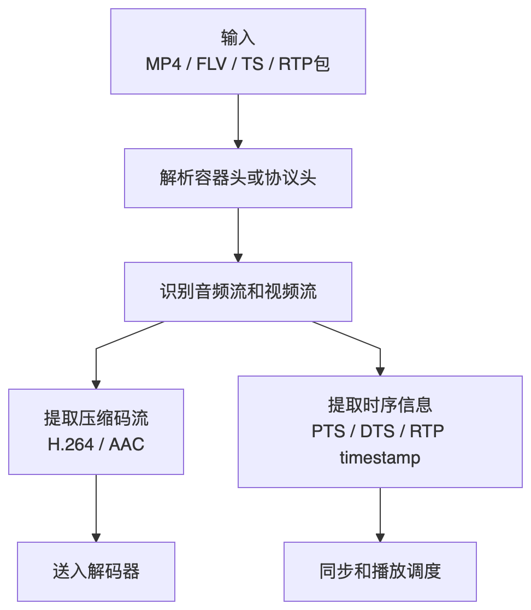

* MP4 -> H.264 视频码流 + AAC 音频码流 + 时间戳

* RTP包 -> H.264 NALU + RTP 时间戳 + 序列号

## 6.2 媒体解封装

媒体解封装面向的是文件或标准容器：

* MP4

* TS

* FLV

* MKV

处理流程通常是：

1. 读取容器数据。

2. 拆出 H.264/H.265 视频码流。

3) 拆出 AAC/Opus 音频码流。

4) 提取时间戳。

5. 送入解码模块。

## 6.3 传输解封装

传输解封装面向的是网络协议包：

* RTP 包

* UDP 私有协议包

处理流程通常是：

1. 解析协议头。

2. 判断帧号。

3) 判断分片序号。

4) 处理乱序。

5. 判断丢包。

6. 做分片重组。

7) 恢复帧边界。

8) 形成连续可用码流。

9. 送入解码模块。

## 6.4 时间戳：PTS、DTS、采集时间和播放时间

音视频系统里，时间戳非常重要。很多同步问题、卡顿问题、延迟问题，根源都是时间戳没有处理对。

### PTS

PTS 是 Presentation Timestamp，表示这一帧应该在什么时候显示或播放。

播放器最终按照 PTS 控制显示节奏。

### DTS

DTS 是 Decoding Timestamp，表示这一帧应该在什么时候送入解码器解码。

如果没有 B帧，很多时候 PTS 和 DTS 相同或接近。

如果有 B帧，编码顺序和显示顺序可能不同，PTS 和 DTS 就会不一样。

### 为什么 B帧会影响 PTS 和 DTS

假设显示顺序是：

```bash
I0 B1 B2 P3
```

B1、B2 可能需要参考后面的 P3。解码器必须先拿到 P3，才能解出 B1、B2。

所以解码顺序可能是：

```bash
I0 P3 B1 B2
```

这就导致：显示顺序 != 解码顺序，PTS != DTS

这也是低延迟场景常常禁用 B帧 的原因之一。

### 采集时间戳

采集时间戳表示这一帧从摄像头或麦克风出来的时间。

实时系统里，采集时间戳比“进入编码器的时间”更有意义。因为如果采集队列已经积压，进入编码器时这帧可能已经晚了几十甚至几百毫秒。

### 播放时钟

播放端通常需要一个主时钟。常见策略包括：

* 以音频时钟为主。

* 以视频时钟为主。

* 以系统时钟为主。

实际播放器里，常用音频时钟作为主时钟，因为人耳对音频卡顿更敏感，而且音频播放设备有自己的消费节奏。

## 6.5 常见问题

解封装阶段常见问题包括：

* 协议头解析错误。

* 分片重组失败。

* 乱序包处理错误。

* 丢包后仍送入错误码流。

* 时间戳丢失。

* 帧边界恢复错误。

### 黑屏排查顺序

优先检查：

1. 是否收到 SPS/PPS。

2. 是否收到 IDR。

3) 解码器输入格式是 Annex B 还是 AVCC。

4) NALU 边界是否正确。

5. 是否把不完整帧送入了解码器。

### 花屏排查顺序

优先检查：

1. 网络是否丢包。

2. 分片重组是否正确。

3) P帧是否依赖了已经损坏的参考帧。

4) 丢包后是否等待下一个 IDR 恢复。

5. SPS/PPS 是否和当前码流匹配。

解封装阶段的判断非常关键。如果明知道一帧没有收完整，还继续送给解码器，后面很容易出现花屏、马赛克或解码失败。

# 第七章：解码

## 7.1 解码的核心目标

解码负责把压缩码流还原成原始数据。

视频解码通常输出：

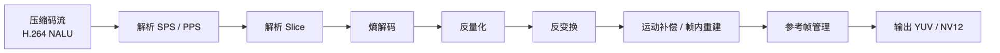

* YUV420P

* NV12

* P010

音频解码通常输出：

* PCM

解码之后的数据才能进入渲染或播放模块。

## 7.2 必学概念

### NALU

NALU 是 H.264/H.265 码流中的基本组织单元。SPS、PPS、IDR、P帧等信息都可以通过 NALU 承载。

### 参考帧

很多视频帧不是独立存在的，而是依赖其他帧解码。参考帧丢失后，后续帧也可能无法正确解码。

### 帧重排序

如果码流中有 B帧，编码顺序和显示顺序可能不同。解码器需要缓存帧并重新排序，这会增加延迟。

### 解码缓存

解码器内部通常有缓存。缓存可以提高处理效率，但也可能增加端到端延迟。

## 7.3 常见解码方案

软件解码：

* FFmpeg libavcodec

硬件解码：

* Linux VAAPI

* Windows DXVA

* Windows D3D11VA

* Android MediaCodec

* Apple VideoToolbox

* NVIDIA NVDEC

软件解码更容易调试。硬件解码性能更高，但输出格式、内存类型、纹理共享方式会更复杂。

## 7.5 常见问题

解码模块需要完成：

1. 将正确格式的码流送入解码器。

2. 理解关键帧之前为什么可能解不出图。

3) 正确取出 YUV 帧。

4) 排查花屏和丢帧问题。

5. 排查码流异常问题。

6. 将解码结果接入渲染模块。

解码阶段常见问题包括：

* SPS/PPS 缺失导致无法解码。

* 参数集不正确导致花屏。

* 关键帧不到位导致不出图。

* 输入顺序错误导致解码异常。

* 解码器内部缓存增加延迟。

* B帧带来重排序延迟。

* 硬解输出格式不适合直接渲染。

## 7.6 解封装和解码的区别

这是初学者最容易混淆的地方。

| 模块  | 做什么             | 输出         |
| --- | --------------- | ---------- |
| 解封装 | 从容器或协议中拆出压缩码流   | H.264、AAC等 |
| 解码  | 将压缩码流还原为原始音视频数据 | YUV、PCM    |

简单说，解封装是“拆盒子”，解码是“还原内容”。

# 第八章：渲染

## 8.1 渲染的核心目标

渲染负责把解码后的数据变成用户能看到、能听到的内容。

视频渲染负责把 YUV、NV12 等图像数据显示到屏幕。音频渲染负责把 PCM 数据送到播放设备。

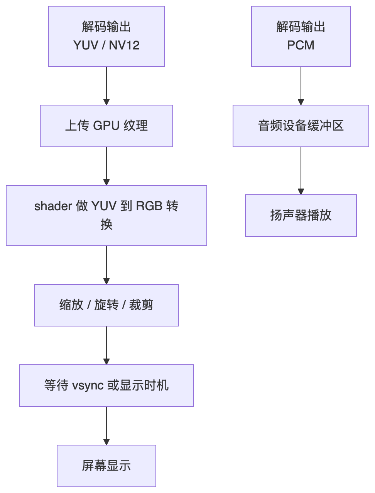

## 8.2 视频渲染核心概念

必须理解的概念包括：

* YUV 到 RGB 转换

* 纹理上传

* 双缓冲

* 三缓冲

* vsync

* 渲染线程

* UI线程

* CPU侧数据

* GPU侧纹理

视频解码器输出的数据通常不是屏幕最终显示的 RGB 格式。高性能渲染中，通常会把 YUV 或 NV12 上传为 GPU 纹理，再通过 shader 完成颜色空间转换。

## 8.3 常见图形技术

常见渲染技术包括：

* OpenGL

* Vulkan

* Direct3D

* SDL

* Qt + OpenGL

入门阶段可以优先使用 OpenGL 或 SDL 跑通显示链路。深入阶段再考虑 Vulkan、Direct3D 或平台硬解纹理直通。

## 8.4 推荐渲染流程

推荐流程：

```bash
解码器输出 YUV/NV12
    ↓
将 YUV/NV12 直接上传为 GPU 纹理
    ↓
使用 shader 在 GPU 中完成 YUV 到 RGB 转换
    ↓
显示到屏幕
```

不推荐流程：

```bash
解码器输出 YUV
    ↓
CPU 先把 YUV 转 RGB
    ↓
再把 RGB 上传到 GPU
```

不推荐流程的问题是 CPU 计算开销更高，内存拷贝更多，上传到 GPU 的数据量也更大。

## 8.5 音视频同步怎么做

音视频同步的核心是让音频和视频在同一条时间线上播放。

如果视频 PTS 比音频时钟慢，说明视频落后，可以考虑丢帧追赶。

如果视频 PTS 比音频时钟快，说明视频太超前，可以稍微等待。

简化逻辑可以这样理解：

```bash
diff = video_pts - audio_clock

diff > 0: 视频超前，等一等再显示
diff < 0: 视频落后，必要时丢帧追赶
```

常见不同步现象：

| 现象     | 可能原因                    |
| ------ | ----------------------- |
| 嘴型比声音慢 | 视频延迟大、视频队列积压、渲染慢        |
| 声音比画面慢 | 音频缓冲过大、音频时间戳错误          |
| 越播越不同步 | 采样率、帧率、时间基计算错误          |
| 偶发不同步  | 网络抖动、jitter buffer 策略不稳 |

## 8.6 画面颜色不对怎么排查

优先检查：

1. YUV420P、NV12、NV21 是否混用。

2. U/V 分量是否反了。

3) YUV range 是 full range 还是 limited range。

4) BT.601 和 BT.709 矩阵是否用错。

5. shader 采样纹理是否绑定正确。

## 8.7 常见问题

渲染模块需要完成：

1. 将 YUV 数据上传为纹理。

2. 用 shader 做颜色空间转换。

3) 控制画面缩放。

4) 控制画面旋转。

5. 控制画面裁剪。

6. 减少不必要的 CPU 拷贝。

7) 统计解码完成到显示完成的耗时。

渲染阶段常见问题包括：

* CPU 做 YUV 转 RGB 太慢。

* 纹理上传太耗时。

* 渲染线程被其他逻辑阻塞。

* 显示刷新率和视频帧率不匹配。

* 掉帧。

* 卡顿。

* 画面不丝滑。

* 渲染阶段堆积导致整体延迟升高。

渲染模块不是简单地把数据显示出来，还要负责控制延迟、节奏和资源拷贝。

# 第九章：学习建议

## 9.1 不要一开始就追求全平台

音视频技术跨平台差异很大。初学阶段建议先选一个平台深入。

如果使用 Linux，可以从下面这条路线开始：

```bash
V4L2 -> ALSA -> FFmpeg -> Socket -> OpenGL
```

如果使用 Android，可以从下面这条路线开始：

```bash
Camera2 -> AudioRecord -> MediaCodec -> Socket/WebRTC -> Surface/OpenGL ES
```

先在一个平台上掌握完整链路，再迁移到其他平台，效率会更高。

## 9.2 不要一开始就追求所有协议

RTMP、RTSP、RTP、SRT、WebRTC 都很重要，但它们解决的问题不同。

学习顺序建议：

1. 先跑通本地采集、编码、解码、渲染。

2. 再加入简单 TCP 或 UDP 传输。

3) 再学习 RTP/RTCP 的时间戳和序列号机制。

4) 再根据业务方向学习 RTMP、SRT 或 WebRTC。

## 9.3 推荐学习顺序

推荐按照下面顺序学习：

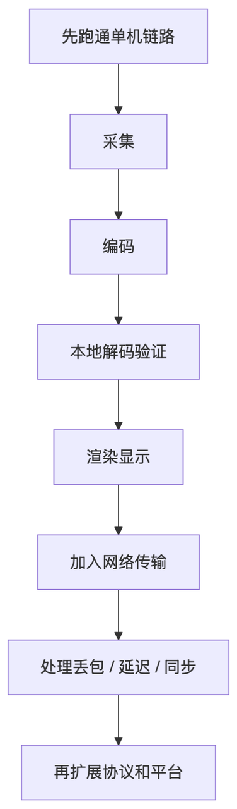

采集 -> 编码 -> 封装 -> 传输 -> 解封装 -> 解码 -> 渲染

这个顺序的好处是每一步都有明确输入和输出，不容易在概念上混乱。

## 10.4 核心经验

音视频开发不是单点技术，而是一条连续链路。

真正影响系统质量的，通常是这些问题：

* 数据格式是否统一。

* 时间戳是否连续。

* 队列是否可控。

* 关键帧是否正确。

* 丢包后是否能恢复。

* CPU 和 GPU 拷贝是否过多。

* 每个阶段的耗时是否可观测。

链路先通比局部完美更重要。先做出一个能跑通的最小系统，再逐步处理延迟、丢包、花屏、同步和性能问题。

# 第十章：用 FFmpeg 验证核心概念

这一章不是要求必须依赖 FFmpeg 开发完整系统，而是用 FFmpeg 快速验证概念。真正理解编码参数，最好的方式是自己生成几组文件对比。

## 10.1 生成测试视频

生成一个 10 秒、30fps、1280x720 的测试视频：

ffmpeg -f lavfi -i testsrc2=size=1280x720:rate=30 -t 10 -pix\_fmt yuv420p test.yuv

这个文件是裸 YUV，没有封装、没有编码，体积会比较大。

计算大小：

1280 \* 720 \* 1.5 \* 30 \* 10 = 414720000 字节

约 395MB。

这能直观看到原始视频数据为什么必须编码压缩。

## 10.2 用不同 QP 编码 H.264

固定 QP 为 20：

ffmpeg -s 1280x720 -r 30 -pix\_fmt yuv420p -i test.yuv -c:v libx264 -qp 20 qp20.h264

固定 QP 为 35：

ffmpeg -s 1280x720 -r 30 -pix\_fmt yuv420p -i test.yuv -c:v libx264 -qp 35 qp35.h264

观察点：

* qp20.h264 通常更大。

* qp35.h264 通常更小。

* QP 高时，细节更容易丢失，块效应更明显。

## 10.3 对比 CBR 和 CRF

CBR 示例：

ffmpeg -s 1280x720 -r 30 -pix\_fmt yuv420p -i test.yuv -c:v libx264 -b:v 2M -maxrate 2M -bufsize 2M cbr\_2m.mp4

CRF 示例：

ffmpeg -s 1280x720 -r 30 -pix\_fmt yuv420p -i test.yuv -c:v libx264 -crf 23 crf23.mp4

观察点：

* CBR 更接近固定带宽目标。

* CRF 更偏向稳定主观质量。

* CRF 输出文件大小会随画面复杂度变化。

## 10.4 观察关键帧间隔

设置 GOP 为 30：

ffmpeg -s 1280x720 -r 30 -pix\_fmt yuv420p -i test.yuv -c:v libx264 -g 30 gop30.mp4

设置 GOP 为 120：

ffmpeg -s 1280x720 -r 30 -pix\_fmt yuv420p -i test.yuv -c:v libx264 -g 120 gop120.mp4

观察点：

* GOP 30 约每 1 秒一个关键帧。

* GOP 120 约每 4 秒一个关键帧。

* GOP 短时恢复快，但码率可能更高。

* GOP 长时压缩效率好，但随机访问和错误恢复变差。

## 10.5 低延迟编码参数示例

低延迟 H.264 编码示例：

ffmpeg -s 1280x720 -r 30 -pix\_fmt yuv420p -i test.yuv \\
&#x20; -c:v libx264 \\
&#x20; -preset veryfast \\
&#x20; -tune zerolatency \\
&#x20; -g 30 \\
&#x20; -bf 0 \\
&#x20; -b:v 2M \\
&#x20; low\_latency.mp4

关键参数含义：

| 参数                | 含义                |
| ----------------- | ----------------- |
| -preset veryfast  | 提高编码速度，牺牲部分压缩效率   |
| -tune zerolatency | 减少编码器内部缓存         |
| -g 30             | 30fps 下约 1 秒一个关键帧 |
| -bf 0             | 禁用 B帧，降低重排序延迟     |
| -b:v 2M           | 设置目标视频码率          |

## 10.6 查看码流信息

使用 ffprobe 查看视频流信息：

ffprobe -show\_streams -select\_streams v:0 low\_latency.mp4

重点看：

* codec\_name

* profile

* width

* height

* pix\_fmt

* r\_frame\_rate

* avg\_frame\_rate

* bit\_rate

* time\_base

这些字段能帮助你确认编码输出是否符合预期。

## 10.7 从 MP4 提取 Annex B H.264

MP4 内部常见是 AVCC 格式。如果要提取为 Annex B 裸流，可以使用：

ffmpeg -i low\_latency.mp4 -c:v copy -bsf:v h264\_mp4toannexb out.h264

然后可以用十六进制工具观察起始码：

00 00 00 01

这个实验能帮助理解 Annex B 和 AVCC 的区别。

## 10.8 实验记录表

建议每次实验记录下面这些信息：

| 实验项     | 参数      | 文件大小 | 主观画质 | 延迟感受    | 备注     |
| ------- | ------- | ---- | ---- | ------- | ------ |
| QP 20   | -qp 20  | 记录大小 | 清晰度  | 不关注     | 对比 QP  |
| QP 35   | -qp 35  | 记录大小 | 是否糊  | 不关注     | 对比 QP  |
| CBR 2M  | -b:v 2M | 记录大小 | 是否稳定 | 适合实时    | 对比码控   |
| CRF 23  | -crf 23 | 记录大小 | 是否稳定 | 不适合严控带宽 | 对比码控   |
| GOP 30  | -g 30   | 记录大小 | 正常   | 恢复快     | 对比 GOP |
| GOP 120 | -g 120  | 记录大小 | 正常   | 恢复慢     | 对比 GOP |

实验不是为了背命令，而是建立参数和现象之间的对应关系。
