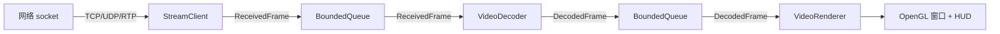
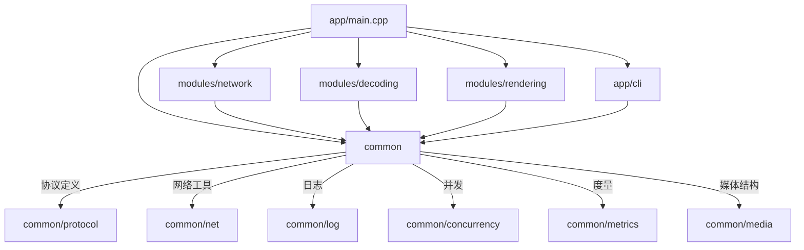

# sclient 源码架构总览

## 1. 项目整体架构

`sclient` 是一个面向低延时视频接收、解码、渲染的 C++14 客户端。项目的核心目标不是做一个完整播放器，而是提供一条可测量、可联调的最小视频管线（pipeline），方便后续扩展硬件解码、更多传输协议和观测能力。

当前已实现的数据链路：

```
网络接收 → 帧重组 → H.264 解码 → OpenGL 渲染 → HUD 叠加
```

项目采用模块化分层架构，核心分为三层：

| 层级 | 目录 | 职责 |
|---|---|---|
| 应用层 | `src/app/` | 入口、CLI 解析、管线编排 |
| 业务模块层 | `src/modules/` | 网络接收、视频解码、视频渲染 |
| 公共基础层 | `src/common/` | 日志、协议、并发队列、度量、网络工具 |

## 2. src/ 目录树

```text
src/
├── app/                            # 应用入口层
│   ├── main.cpp                    # 程序入口，管线编排
│   └── cli/
│       ├── CliOptions.h            # CLI 解析接口
│       └── CliOptions.cpp          # CLI 解析实现
├── adapters/                       # 适配器层（当前为空，预留扩展）
├── common/                         # 公共基础层
│   ├── concurrency/
│   │   └── BoundedQueue.h          # 有界线程安全队列
│   ├── log/
│   │   ├── Logger.h                # 日志接口
│   │   └── Logger.cpp              # 日志实现（控制台 + 文件）
│   ├── media/
│   │   └── DecodedFrame.h          # 解码后帧数据结构
│   ├── metrics/
│   │   └── LatencyStats.h          # 延迟统计（min/avg/p50/p95/p99/max）
│   ├── net/
│   │   ├── H264AnnexB.h            # H.264 Annex B 拼接与 IDR 检测
│   │   ├── RtpProtocol.h           # RTP 协议解析与序列化
│   │   ├── SdpSessionDescription.h # SDP 解析接口
│   │   └── SdpSessionDescription.cpp
│   └── protocol/
│       └── Protocol.h              # 应用层协议定义（消息头、UDP 分片、NACK）
└── modules/                        # 业务模块层
    ├── network/                    # 网络接收模块
    │   ├── StreamClient.h          # 统一接收客户端接口
    │   ├── StreamClient.cpp        # 连接管理、KeepAlive
    │   ├── StreamClientInternal.h  # 内部工具函数
    │   ├── StreamClientTcp.cpp     # TCP 接收实现
    │   ├── StreamClientUdp.cpp     # UDP 接收、分片重组、NACK、FEC
    │   ├── StreamClientRtp.cpp     # RTP 接收、FU-A 重组
    │   ├── AdaptiveJitterBuffer.h  # 自适应抖动缓冲
    │   └── types/
    │       ├── ClientConfig.h      # 客户端配置结构体
    │       ├── ReceivedFrame.h     # 接收到的帧数据结构
    │       └── UdpReceiveStats.h   # UDP 接收统计结构体
    ├── decoding/                   # 视频解码模块
    │   ├── VideoDecoder.h          # 解码器统一接口
    │   ├── VideoDecoder.cpp        # 解码器工厂与调度
    │   ├── VideoDecoderBackend.h   # 解码后端抽象基类
    │   └── software/
    │       └── SoftwareVideoDecoderBackend.cpp  # FFmpeg 软件解码实现
    └── rendering/                  # 视频渲染模块
        ├── VideoRenderer.h         # 渲染器统一接口
        ├── VideoRenderer.cpp       # 渲染器工厂与调度
        ├── VideoRendererBackend.h  # 渲染后端抽象基类
        └── opengl/
            ├── OpenGlVideoRendererBackend.h
            ├── OpenGlVideoRendererBackend.cpp   # OpenGL 渲染实现
            ├── OpenGlVideoRendererHud.h
            ├── OpenGlVideoRendererHud.cpp        # HUD 面板（ImGui）
            ├── ImGuiOpenGL3Backend.cpp            # ImGui OpenGL3 后端桥接
            └── shaders/
                ├── video_renderer.vert            # 顶点着色器
                └── video_renderer.frag            # 片段着色器（YUV→RGB）
```

## 3. 服务端数据链路

`sclient` 本身是纯客户端，与 `sserver` 配合使用。服务端负责采集和编码，通过 TCP/UDP/RTP 将 H.264 码流发送到客户端。

服务端行为（供参考，非 sclient 代码）：
- 采集摄像头或测试源 → H.264 编码 → 按协议打包 → 发送

## 4. 客户端数据链路



客户端主循环（`main.cpp`）启动三个线程：

1. **接收线程**：调用 `StreamClient::ReceiveFrame()` 持续接收帧，写入 `received_frames` 队列
2. **解码线程**：从 `received_frames` 队列取出帧，调用 `VideoDecoder::Decode()` 解码，写入 `decoded_frames` 队列
3. **渲染线程**（主线程）：从 `decoded_frames` 队列取出帧，调用 `VideoRenderer::Render()` 渲染到窗口

## 5. 关键模块之间的依赖关系



CMake 构建对应的库：
- `sclient_common`：common/ 下的编译单元
- `sclient_app`：CLI 解析
- `sclient_network`：网络接收
- `sclient_decoding`：视频解码
- `sclient_rendering`：视频渲染

## 6. 从采集到渲染的一帧数据完整流程

以 UDP 传输为例：

1. **服务端**采集一帧，H.264 编码，拆分为多个 UDP 分片（`UdpFrameFragmentHeader`），附加 `FrameDiagnosticMetadata`（采集时间戳、编码时间戳、发送时间戳）
2. **客户端接收线程** `recv()` 收到 UDP 数据报 → `ProcessUdpDatagram()` 解析协议头 → 按 `frame_sequence` 分发到 `UdpFrameAssembly` → 所有分片到齐后组装完整帧
3. 如果开启了 **NACK**，客户端会检测缺失分片并发送 NACK 请求重传
4. 如果开启了 **FEC**，当恰好缺失 1 个分片时，可利用 XOR 奇偶校验恢复
5. 组装完成的帧进入 **jitter buffer**（`AdaptiveJitterBuffer`），根据网络抖动自适应调整缓冲延迟
6. 从 jitter buffer 弹出 → 包装为 `ReceivedFrame` → 推入 `received_frames` 队列
7. **解码线程**从队列取出 → `VideoDecoder::Decode()` → FFmpeg `avcodec_send_packet` / `avcodec_receive_frame` → 产出 `DecodedFrame`（含 YUV420P/NV12 数据和 AVFrame 的 shared_ptr 生命周期管理）
8. 推入 `decoded_frames` 队列
9. **渲染线程**取出最新帧 → OpenGL PBO 上传 YUV 纹理 → 片段着色器 YUV→RGB 转换 → 绘制全屏四边形 → ImGui 渲染 HUD（延迟统计、队列深度、jitter buffer 状态）→ `glfwSwapBuffers()`

## 7. 新人阅读代码的推荐顺序

1. **[README.md](../README.md)**：项目概览、构建运行方式
2. **[src/app/main.cpp](../src/app/main.cpp)**：理解管线编排和三线程模型
3. **[src/common/protocol/Protocol.h](../src/common/protocol/Protocol.h)**：理解应用层协议格式
4. **[src/modules/network/StreamClient.h](../src/modules/network/StreamClient.h)**：理解网络接收接口
5. **[src/modules/network/StreamClientTcp.cpp](../src/modules/network/StreamClientTcp.cpp)**：最简单的接收实现，先看 TCP
6. **[src/modules/network/StreamClientUdp.cpp](../src/modules/network/StreamClientUdp.cpp)**：UDP 分片重组、NACK、FEC、jitter buffer
7. **[src/modules/network/StreamClientRtp.cpp](../src/modules/network/StreamClientRtp.cpp)**：RTP 接收与 FU-A 重组
8. **[src/modules/decoding/VideoDecoder.cpp](../src/modules/decoding/VideoDecoder.cpp)**：解码器工厂模式
9. **[src/modules/decoding/software/SoftwareVideoDecoderBackend.cpp](../src/modules/decoding/software/SoftwareVideoDecoderBackend.cpp)**：FFmpeg 软解码实现
10. **[src/modules/rendering/VideoRenderer.cpp](../src/modules/rendering/VideoRenderer.cpp)**：渲染器工厂模式
11. **[src/modules/rendering/opengl/OpenGlVideoRendererBackend.cpp](../src/modules/rendering/opengl/OpenGlVideoRendererBackend.cpp)**：OpenGL 渲染实现
12. **[src/modules/rendering/opengl/OpenGlVideoRendererHud.cpp](../src/modules/rendering/opengl/OpenGlVideoRendererHud.cpp)**：HUD 叠加面板
