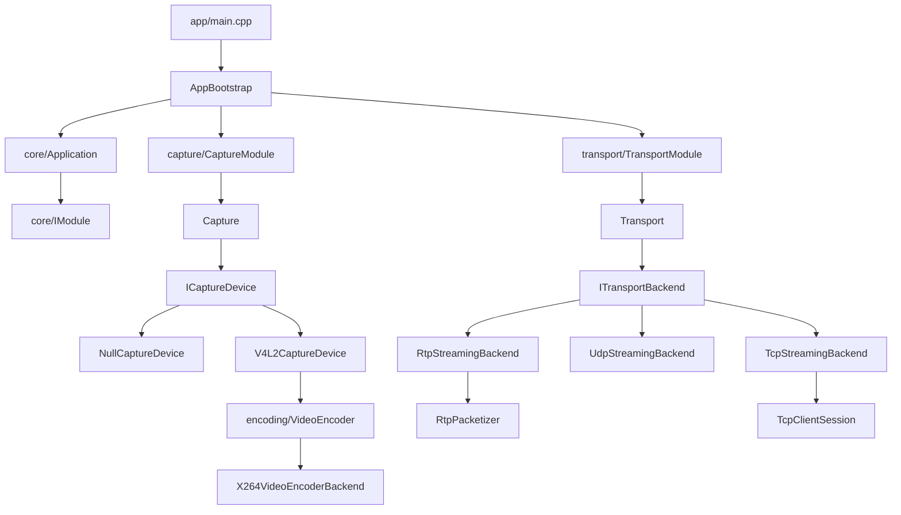

# src/ 架构总览

## 1. 项目整体架构

sserver 是一个实时音视频流媒体服务端，核心链路为：**视频采集 → H.264 编码 → 网络传输**。

当前已实现完整的视频采集编码传输链路，音频链路预留了目录结构但尚未实现。

架构分层遵循以下原则：
- `common` 层提供无业务语义的基础能力（日志、队列、协议结构、时间工具）
- `config` 层负责配置模型和加载校验
- `core` 层负责应用生命周期和模块编排
- `modules` 层实现具体业务能力（采集、编码、传输），每个模块内部采用「门面 + backend 接口 + 工厂」模式
- `app` 层负责启动编排和跨模块桥接

依赖方向严格单向：

```
app → core → config → common
app → modules → core / common / config
modules 内部通过抽象接口通信，不直接依赖彼此私有实现
```

## 2. src/ 目录树

```
src/
├── app/                        # 程序入口与启动编排
│   ├── main.cpp
│   ├── AppBootstrap.h
│   └── AppBootstrap.cpp
├── core/                       # 应用生命周期与模块编排
│   ├── IModule.h
│   ├── ModuleState.h
│   ├── ApplicationContext.h
│   ├── Application.h
│   └── Application.cpp
├── config/                     # 配置模型、加载与校验
│   ├── AppConfig.h
│   └── AppConfig.cpp
├── common/                     # 无业务语义的基础能力
│   ├── concurrency/
│   │   └── ThreadSafeQueue.h
│   ├── log/
│   │   ├── Logger.h
│   │   └── Logger.cpp
│   ├── metrics/
│   │   ├── LatencyRecorder.h
│   │   └── LatencyRecorder.cpp
│   ├── model/
│   │   └── EncodedFrame.h
│   ├── net/
│   │   ├── H264AnnexB.h
│   │   ├── RtpProtocol.h
│   │   └── StreamProtocol.h
│   └── time/
│       └── MonotonicClock.h
└── modules/                    # 业务能力模块
    ├── capture/
    │   └── video/
    │       ├── ICaptureDevice.h
    │       ├── Capture.h / .cpp
    │       ├── CaptureModule.h / .cpp
    │       ├── null/
    │       │   ├── NullCaptureDevice.h
    │       │   └── NullCaptureDevice.cpp
    │       └── v4l2/
    │           ├── V4L2CaptureDevice.h
    │           └── V4L2CaptureDevice.cpp
    ├── encoding/
    │   └── video/
    │       ├── VideoEncoderBackend.h
    │       ├── VideoEncoder.h / .cpp
    │       └── x264/
    │           ├── X264VideoEncoderBackend.h
    │           └── X264VideoEncoderBackend.cpp
    └── transport/
        ├── ITransportBackend.h
        ├── Transport.h / .cpp
        ├── TransportModule.h / .cpp
        ├── tcp/
        │   ├── TcpStreamingBackend.h / .cpp
        │   └── TcpClientSession.h / .cpp
        ├── udp/
        │   └── UdpStreamingBackend.h / .cpp
        └── rtp/
            ├── RtpPacketizer.h / .cpp
            └── RtpStreamingBackend.h / .cpp
```

## 3. 服务端数据链路

服务端数据链路为单向推送模型：

```
V4L2 设备 (/dev/videoX)
  → V4L2CaptureDevice (DQBUF → YUYV422 原始帧)
  → VideoEncoder / X264VideoEncoderBackend (YUYV422 → I420 → H.264 Annex-B)
  → EncodedFrame (携带时间戳、序列号、是否关键帧)
  → AppBootstrap 绑定的 FrameHandler 回调
  → TransportModule::Broadcast()
  → Transport → ITransportBackend
  → TCP: TcpStreamingBackend → TcpClientSession (per-client 线程发送)
  → UDP: UdpStreamingBackend (分片 + FEC + NACK 重传)
  → RTP: RtpPacketizer (NALU 分片 FU-A) → RtpStreamingBackend (Pacing 发送)
```

## 4. 客户端数据链路

当前项目为纯服务端，不包含客户端实现。客户端需要：
- TCP：连接服务端端口，接收 `MessageHeader + payload` 格式的数据帧
- UDP：发送 KeepAlive 注册，接收分片后重组为完整帧，支持 NACK 请求重传
- RTP：通过 SDP 文件描述流信息，使用 ffplay 等标准 RTP 播放器接收

## 5. 关键模块之间的依赖关系



## 6. 从采集到渲染的一帧数据完整流程

以 V4L2 采集 + x264 编码 + RTP 传输为例：

1. **采集**：`CaptureModule` 的 `CapturePump` 线程调用 `V4L2CaptureDevice::CaptureRawFrame()`，执行 `VIDIOC_DQBUF` 从内核缓冲区取出 YUYV422 原始帧
2. **入队**：原始帧通过 `ThreadSafeQueue<RawCaptureFramePtr>` 传递给 `EncodePump` 线程（队列深度 3，满时丢弃最旧帧）
3. **编码**：`EncodePump` 线程调用 `V4L2CaptureDevice::EncodeRawFrame()`，内部执行 `ConvertYuyv422ToI420`（ARM64 上使用 NEON 加速）后调用 `x264_encoder_encode` 生成 H.264 Annex-B 数据
4. **封装**：生成 `EncodedFrame`，携带 `sequence`、`capture_timestamp_ns`、`encode_start/end_timestamp_ns`、`is_keyframe`、`payload`
5. **回调**：通过 `FrameHandler` 回调直接调用 `TransportModule::Broadcast(frame)`
6. **RTP 打包**：`RtpPacketizer::Packetize()` 将 Annex-B 数据拆分为 NALU，小于 `rtp_max_payload_size` 的直接打包，大于的使用 FU-A 分片
7. **Pacing 发送**：`RtpStreamingBackend::Broadcast()` 对每个 RTP 包计算 pacing 间隔，通过 `clock_nanosleep` 控制发送节奏，避免突发
8. **时间戳嵌入**：每个 RTP 包携带自定义 latency header extension（profile 0x5353），包含 `capture_timestamp_ns` 和 `transport_send_timestamp_ns`

## 7. 新人阅读代码的推荐顺序

1. **先看配置**：`src/config/AppConfig.h` — 理解所有可配置参数
2. **再看启动流程**：`src/app/main.cpp` → `AppBootstrap` — 理解程序如何启动和退出
3. **理解模块框架**：`src/core/IModule.h` → `Application` — 理解模块生命周期管理
4. **看公共结构**：`src/common/model/EncodedFrame.h` — 核心数据结构
5. **看采集链路**：`src/modules/capture/video/CaptureModule.h` → `ICaptureDevice.h` → `V4L2CaptureDevice`
6. **看编码链路**：`src/modules/encoding/video/VideoEncoder.h` → `X264VideoEncoderBackend`
7. **看传输链路**：`src/modules/transport/TransportModule.h` → 选择感兴趣的 backend（TCP/UDP/RTP）
8. **看公共协议**：`src/common/net/StreamProtocol.h`、`RtpProtocol.h` — 理解线上协议格式
